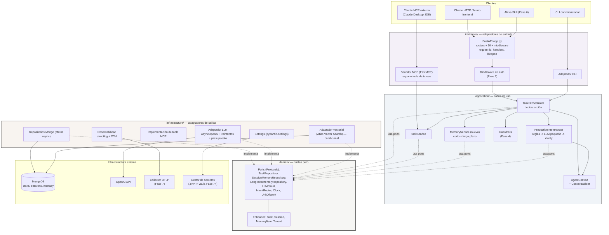
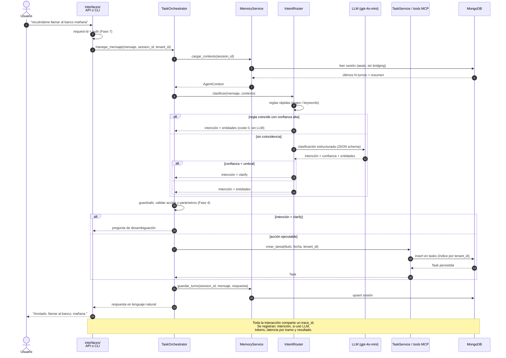
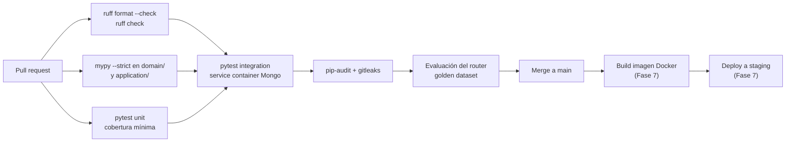
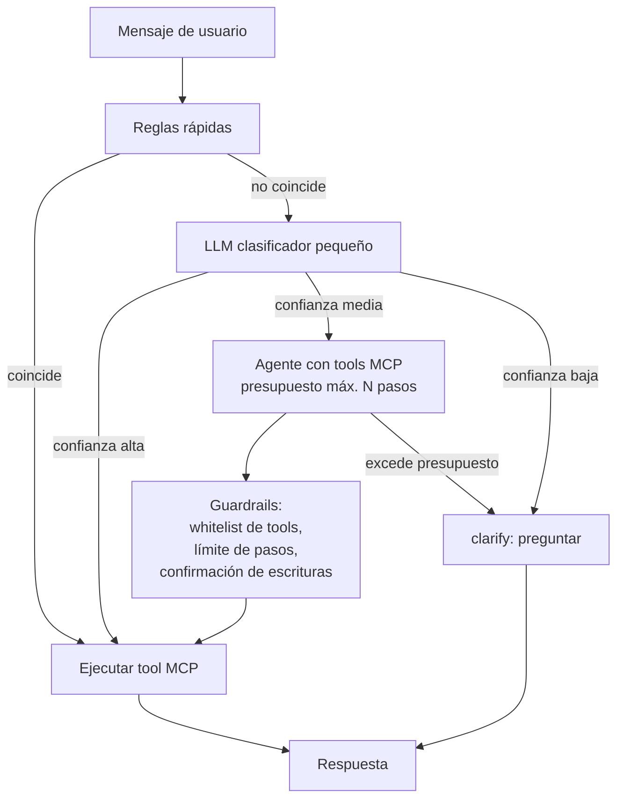
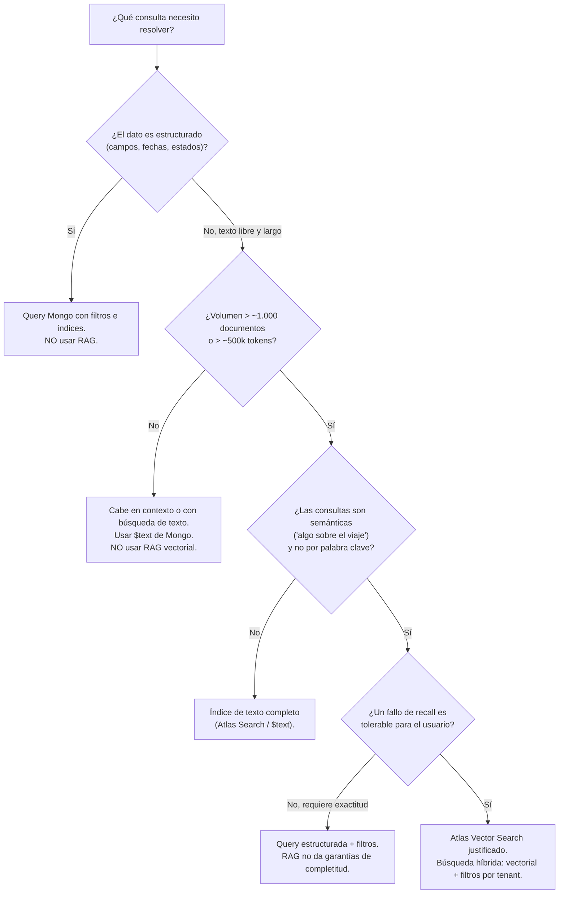

# Anexo A — Arquitectura objetivo industrializada

> **Estado:** propuesta de diseño. Este anexo no describe el sistema actual, sino el destino al que se
> converge de forma incremental a lo largo de las fases 0–8 ya definidas en el roadmap.
> **Alcance:** empaquetado, configuración, observabilidad, CI/CD, containerización, estrategia de agentes,
> memoria, RAG, seguridad, testing y multi-tenancy.
> **Regla de oro:** cada cambio debe dejar el sistema funcional, respetar la separación
> `domain / application / infrastructure / interfaces`, y no introducir complejidad que no se pueda explicar
> en una sesión de aprendizaje.

## A.0 Cómo leer este anexo: clasificación de propuestas

Cada propuesta no trivial está etiquetada con uno de estos tres niveles. La etiqueta es la parte
importante: dice **si adoptar ahora, si esperar a una fase, o si no adoptar todavía**.

| Etiqueta | Significado | Criterio de adopción |
| --- | --- | --- |
| 🟢 **Higiene inmediata** | Coste bajo (horas), beneficio inmediato, reduce riesgo de errores silenciosos. | Adoptar ya, en Fase 0 o 1. |
| 🟡 **Industrialización esperable** | Coste moderado (días), se justifica porque una fase próxima lo va a necesitar de todos modos. | Adoptar cuando entre la fase que la consume, no antes. |
| 🔴 **Vanguardia opcional** | Coste alto o complejidad conceptual alta. Riesgo real de adopción prematura. | Solo si se cumple el criterio concreto que se indica. Si el criterio no se cumple, **no adoptar** y dejarlo documentado como decisión consciente. |

Principio transversal: **la deuda técnica que produce fallos silenciosos se paga antes que la que produce
fallos ruidosos.** El bug de bridging sync/async de la memoria de sesión (§A.7) es el ejemplo canónico y es
la prioridad número uno de Fase 0.

---

## A.1 Arquitectura de componentes objetivo

**Lecturas clave del diagrama**

- `domain/` no importa nada de las otras capas. Sigue siendo la regla estructural que no se negocia.
- Todo lo nuevo entra **como port + adaptador**, nunca como dependencia directa desde `application/`.
  Esto incluye el LLM: hoy el cliente OpenAI se usa de forma síncrona y acoplada; en el diseño objetivo es
  un `LLMClient` (Protocol) con un adaptador `AsyncOpenAI`.
- El servidor MCP es un **adaptador de entrada más**, no un caso de uso. Entra por `interfaces/` y baja a
  `TaskService`, exactamente igual que la API REST. Esa simetría es lo que permite que MCP y REST compartan
  reglas de negocio y validación sin duplicar lógica.
- Los componentes marcados con fase (`AUTHM`, `GUARD`, `OBS`, `VEC`) existen en el diagrama para fijar
  **dónde encajarán**, no para construirlos ya.

---

## A.2 Flujo de datos de una interacción típica

**Invariantes del flujo**

1. **El camino barato va primero.** Reglas antes que LLM. Cada interacción registra si consumió LLM: es la
   métrica que permite discutir coste con datos y no con intuición.
2. **La baja confianza no adivina, pregunta.** `clarify` es una salida de primera clase, no un fallback
   avergonzado.
3. **La escritura en memoria ocurre después de la acción**, y su fallo se registra explícitamente. Nunca
   `except: pass`.
4. **`tenant_id` viaja por todo el flujo desde el día uno** como campo, aunque hoy valga siempre
   `"default"` (§A.11). Añadirlo después obliga a migrar datos; llevarlo desde ya cuesta un parámetro.

---

## A.3 Empaquetado y gestión de dependencias

**Objetivo:** que el proyecto se instale con un comando, que las dependencias sean explícitas y
reproducibles, y que desaparezcan los hacks de `sys.path`.

### 🟢 Higiene inmediata (Fase 0)

- **`pyproject.toml` con layout `src/`.** Un único fichero declara metadatos, dependencias y configuración
  de herramientas (`ruff`, `mypy`, `pytest`). Instalación editable: `pip install -e ".[dev]"`. Con esto
  `sys.path` deja de tocarse y los imports son iguales en tests, CLI y API.
- **Declarar `motor` explícitamente.** Hoy se usa por transitividad. Toda dependencia que se importa en el
  código debe estar declarada, sin excepciones.
- **Separar grupos de dependencias:** base (`fastapi`, `pydantic`, `motor`, `httpx`), `[dev]` (pytest,
  ruff, mypy), `[llm]` (`openai`), `[mcp]` (`mcp`). Permite un contenedor de API sin herramientas de
  desarrollo y hace visible qué parte del sistema arrastra qué peso.
- **Fijar versiones con rangos conservadores** (`fastapi>=0.115,<0.120`) y un lockfile en el repo.

### 🟡 Industrialización esperable (Fase 1)

- **Adoptar `uv` como gestor.** Sustituye a pip para resolución e instalación (`uv sync`, `uv run`,
  `uv lock`), genera lockfile determinista y es órdenes de magnitud más rápido en CI. Compatible con
  `pyproject.toml` estándar: si se abandona, se vuelve a pip sin reescribir nada. Es la elección
  recomendada frente a Poetry, que impone su propio flujo y aporta poco a un proyecto de este tamaño.
- **Versionado semántico + `CHANGELOG.md`.** Con propósito pedagógico: obliga a nombrar qué cambió en cada
  paso.

### Definition of Done

- [ ] `git clone && uv sync && uv run pytest` funciona en una máquina limpia sin pasos manuales.
- [ ] Ningún fichero del repo manipula `sys.path`.
- [ ] `pip check` / `uv lock --check` pasan sin avisos.
- [ ] Toda librería importada en `src/` aparece en `pyproject.toml`.
- [ ] Lockfile versionado y actualizado en el mismo commit que cualquier cambio de dependencias.

---

## A.4 Configuración y secretos

**Objetivo:** una sola fuente de verdad de configuración, tipada y validada al arrancar; cero secretos en
el repo; fallo temprano y ruidoso ante configuración inválida.

### 🟢 Higiene inmediata (Fase 0)

- **Un único `Settings` con `pydantic-settings`** (`BaseSettings`), instanciado una vez en el `lifespan` de
  FastAPI e inyectado por `Depends`. Elimina los dos mecanismos actuales de carga de entorno: se prohíbe
  `os.getenv` fuera de `infrastructure/config`.
- **Resolver la inconsistencia de nombre de base de datos.** Un único campo `mongo_database` consumido por
  todos los repositorios. El repositorio de memoria de sesión no define su propio default. Este bug hace
  que datos que se creen mirar en una colección vivan en otra: es exactamente la clase de fallo silencioso
  que se paga primero.
- **`.env.example` versionado**, con todas las claves, valores de ejemplo no sensibles y un comentario por
  variable. Es la documentación operativa mínima del proyecto.
- **Rotar la API key de OpenAI expuesta** y confirmar que `.env` está en `.gitignore`. Una clave que
  estuvo en una máquina de desarrollo se considera comprometida por defecto.
- **Validación estricta al arrancar:** tipos, campos obligatorios y `SecretStr` para todo secreto (evita
  que aparezca en logs o en un `repr`). Si falta configuración, el proceso no arranca.

### 🟡 Industrialización esperable (Fase 7)

- **Secretos inyectados por el entorno de despliegue**, no por ficheros. En un despliegue de bajo coste
  (Fly.io, Railway, Render) basta el gestor de secretos de la plataforma.
- **Perfiles de entorno** (`local`, `ci`, `prod`) que solo cambien valores, nunca estructura.

### 🔴 Vanguardia opcional

- **Vault / AWS Secrets Manager con rotación automática.** **Criterio:** adoptar solo cuando exista más de
  un entorno productivo real con datos de terceros, o cuando más de dos personas necesiten acceso
  diferenciado a credenciales. Antes de eso, el gestor de secretos de la plataforma de despliegue cubre el
  caso con una fracción del coste operativo.
- **Feature flags dinámicos.** **Criterio:** solo cuando haya usuarios reales a los que exponer cambios de
  forma gradual. Hasta entonces, un campo booleano en `Settings` es suficiente y más legible.

### Definition of Done

- [ ] `grep -rn "os.getenv" src/` solo devuelve resultados en el módulo de configuración.
- [ ] Arrancar sin una variable obligatoria produce un error claro que la nombra.
- [x] `.env.example` cubre el 100 % de los campos de `Settings` (`mongo_uri`, `mongo_db_name`,
      `openai_api_key`, `openai_model`, `llm_provider`, `ollama_base_url`, `ollama_model`), con un comentario por variable.
- [ ] Ningún secreto aparece en logs ni en respuestas de error (test que lo verifique).
- [ ] Un único nombre de base de datos en todo el código, verificado por test.

---

## A.5 Observabilidad

**Objetivo:** poder responder, sobre cualquier interacción, qué intención se detectó, si se usó LLM, cuánto
costó y dónde se fue el tiempo. En un sistema con LLM esto no es lujo operativo: es el instrumento de
diagnóstico principal, porque los fallos son probabilísticos y no reproducibles a mano.

### 🟢 Higiene inmediata (Fase 0–1)

- ✅ **Eliminar todos los `print`.** Logging estructurado en JSON con `structlog`, un solo configurador en
  `infrastructure/observabilidad/logging.py` (`configure_logging`/`get_logger`, se autoconfigura al
  importarse). Reemplazados los dos `print` usados como diagnóstico (`client.py`: fallo de conexión a
  Mongo; `app.py`: evento de auditoría de creación de tarea). Los `print` de `interfaces/cli.py` se dejaron
  intactos a propósito: son la salida real del producto (lo que el usuario lee en la terminal), no logging.
- ✅ **Propagar el `request_id` existente** a todos los logs de la petición vía context vars. Se consolidó
  además el middleware duplicado que existía (`RequestIdMiddleware` + `add_request_id_header` hacían lo
  mismo, generando dos UUIDs independientes — se dejó solo uno) y se agregó
  `structlog.contextvars.bind_contextvars(request_id=...)`/`clear_contextvars()` en su `dispatch`, así que
  cualquier log emitido durante esa petición, en cualquier módulo, incluye `request_id` sin pasarlo a mano.
- **Campos mínimos por interacción conversacional:** `request_id`, `session_id`, `tenant_id`, `intencion`,
  `confianza`, `uso_llm` (bool), `modelo`, `tokens_entrada`, `tokens_salida`, `latencia_ms_total`,
  `latencia_ms_llm`, `resultado`. Con estos doce campos ya se puede calcular coste por interacción y tasa
  de `clarify` sin instrumentación adicional. **Pendiente** — el logging estructurado ya existe pero
  ninguna interacción emite todavía estos campos (depende del router/orquestador, Fase 2+).
- **Nunca registrar contenido sensible del usuario por defecto.** Pendiente de verificar con un test
  explícito (mismo pendiente que `SecretStr`, ver §A.11).

### 🟡 Industrialización esperable (Fase 7, adelantable a Fase 4)

- **OpenTelemetry con tracing distribuido.** Instrumentación automática de FastAPI y Motor, más spans
  manuales en los tramos que importan: `router.clasificar`, `llm.completar`, `orquestador.ejecutar`,
  `memoria.cargar`. Exportar por OTLP a un backend gratuito o autoalojado (Jaeger en local, Grafana Tempo
  o Langfuse en cloud).
- **Métricas** (contadores e histogramas): interacciones por intención, ratio de resolución por reglas vs
  LLM, latencia p50/p95 por tramo, tokens acumulados por día, errores por tipo.
- **Nota de secuencia:** si Fase 4 (agentes) llega antes que Fase 7, **adelantar el tracing a Fase 4**.
  Depurar un agente con múltiples saltos sin traces es la forma más rápida de perder días.

### 🔴 Vanguardia opcional

- **Plataforma de observabilidad específica de LLM** (Langfuse, Phoenix) con replay de prompts y
  anotación humana. **Criterio:** adoptar cuando el golden dataset del router (§A.10) supere ~200 casos o
  cuando haya más de un prompt en producción cuya calidad haya que comparar entre versiones. Antes de eso,
  logs estructurados + un script de análisis cubren el caso.
- **SLOs con alerting.** **Criterio:** solo con usuarios externos y alguien de guardia. Un SLO sin nadie
  que reaccione es decoración.

### Definition of Done

- [x] Cero `print` usados como logging en `src/` (los de `interfaces/cli.py` son salida del producto, no
      diagnóstico — ver nota arriba).
- [x] Todo log de una petición comparte `request_id` (contextvars en `RequestIdMiddleware`).
- [ ] Existe una consulta o script que devuelve coste estimado y tasa de `clarify` del último día.
- [ ] Un test verifica que los secretos y los prompts no se registran con la configuración por defecto.

---

## A.6 CI/CD con GitHub Actions

**Objetivo:** que ningún cambio que rompa formato, tipos, tests o la calidad del router llegue a `main`.
En un proyecto educativo la CI tiene un valor extra: convierte los principios en verificaciones automáticas
en vez de recordatorios.

### Pipeline objetivo

### 🟢 Higiene inmediata (Fase 0–1)

- **Job `calidad`:** `ruff format --check`, `ruff check`, `mypy` en modo estricto sobre `domain/` y
  `application/` (gradual en el resto: exigir estricto en todo el repo de golpe genera cientos de errores
  y se abandona).
- **Job `tests`:** unitarios con umbral de cobertura (empezar en el valor actual y subirlo, nunca bajarlo).
- **Matriz Python 3.10 y 3.12** para detectar dependencias de versión temprano.
- **`gitleaks`** en cada PR. Barato, y este proyecto ya tuvo un incidente de clave expuesta.
- **Caché de `uv`** en CI: reduce el tiempo de pipeline a segundos.

### 🟡 Industrialización esperable (Fase 1–4)

- **Job `integration` con Mongo real** como *service container* de GitHub Actions (§A.10).
- **Job `eval-router`** — la pieza más específica de este proyecto y la que más valor aporta:
  1. Ejecuta el router sobre el golden dataset versionado (`tests/eval/golden_router.jsonl`).
  2. Calcula accuracy global, accuracy por intención, tasa de `clarify` y coste en tokens.
  3. Compara contra los umbrales declarados en `tests/eval/umbrales.yaml`.
  4. **Falla el PR si la accuracy cae**; publica una tabla comparativa como comentario.
  5. Se ejecuta con `gpt-4o-mini` real solo en PRs con etiqueta `evaluar-router` o en `main` (para no
     pagar LLM en cada push); en el resto usa un cliente grabado tipo VCR.
- **`pip-audit`** para vulnerabilidades de dependencias.

### 🔴 Vanguardia opcional

- **Despliegue continuo automático a producción.** **Criterio:** solo cuando existan integration tests y
  el job de evaluación sea fiable. Hasta entonces, deploy manual con un botón (`workflow_dispatch`).
- **Entornos efímeros por PR.** **Criterio:** solo si hay revisores no técnicos que necesiten probar
  cambios. En un proyecto de una persona es coste puro.

### Definition of Done

- [ ] Un PR con error de formato, de tipos o test roto no se puede mergear.
- [ ] El pipeline de PR tarda menos de 3 minutos en la ruta rápida.
- [ ] `eval-router` produce un informe legible y bloquea regresiones de accuracy.
- [ ] `main` está protegida y exige los checks anteriores.

---

## A.7 Containerización *(opcional — evaluar en Fase 7)*

**Objetivo:** entorno de desarrollo reproducible y artefacto de despliegue único.
**Trade-off honesto:** hasta Fase 7 el proyecto puede vivir perfectamente con `uv sync` y un Mongo local o
un cluster gratuito de Atlas. Docker añade una capa de conceptos (imágenes, redes, volúmenes) que compite
por atención con los objetivos de aprendizaje de las fases 1–6.

**Excepción recomendada:** un `docker-compose.yml` mínimo *solo con Mongo* (sin la aplicación) es 🟢
higiene inmediata útil desde Fase 1. Da un Mongo desechable para integration tests locales, cuesta diez
líneas y no obliga a containerizar la aplicación.

### 🟡 Industrialización esperable (Fase 7)

- **`Dockerfile` multi-stage:** stage `builder` con `uv` que resuelve dependencias en un venv, stage
  `runtime` sobre `python:3.12-slim` que copia solo el venv y `src/`. Usuario no root, `HEALTHCHECK`
  apuntando a `/health`, sin herramientas de build en la imagen final. Objetivo: imagen < 200 MB.
- **`docker-compose.yml` completo** (`api`, `mongo`, opcionalmente `collector` OTLP) con perfiles para
  levantar solo lo necesario.
- **`.dockerignore`** que excluya `.env`, `.git`, tests y caché.

### 🔴 Vanguardia opcional

- **Kubernetes / Helm.** **Criterio:** solo con múltiples servicios que escalen de forma independiente y
  tráfico que lo justifique. Para un servicio FastAPI, una plataforma PaaS es más barata y más simple en
  todos los ejes durante mucho tiempo.
- **Distroless / imágenes multi-arch.** **Criterio:** cuando haya un requisito real de superficie de
  ataque mínima o de despliegue en ARM.

### Definition of Done

- [ ] `docker compose up mongo` deja un Mongo listo para integration tests locales.
- [ ] (Fase 7) `docker build` produce una imagen que arranca solo con variables de entorno.
- [ ] (Fase 7) La imagen no contiene secretos ni dependencias de desarrollo.

---

## A.8 Estrategia de agentes

### Diagnóstico del patrón actual

El diseño actual — `ProductionIntentRouter` (reglas → LLM pequeño → `clarify`) seguido de
`TaskOrchestrator` — no es una limitación, es una decisión buena y a contracorriente de la moda:

- **Coste y latencia bajo control.** Las reglas resuelven gratis los casos frecuentes; el LLM pequeño solo
  entra cuando hace falta.
- **Comportamiento predecible y testeable.** El router es una función clasificadora con entrada y salida
  acotadas: se puede evaluar con un dataset (§A.10). Un agente que decide libremente qué tool llamar es
  mucho más difícil de evaluar.
- **Excelente para enseñar.** Cada decisión del sistema es inspeccionable y explicable.
- **`clarify` como salida explícita** es una práctica que muchos sistemas en producción no tienen.

**Recomendación: mantener orchestrator + router y profundizar en él durante las fases 2–4.** No migrar
todavía.

### Comparativa de alternativas

| Patrón | Ventaja principal | Coste real | Veredicto |
| --- | --- | --- | --- |
| **Router + orquestador (actual)** | Predecible, barato, evaluable, pedagógico | Requiere código explícito por intención | 🟢 **Mantener y profundizar** (Fases 2–4) |
| **Single-agent-with-tools** (el LLM elige la tool vía MCP) | Menos código de routing; absorbe intenciones nuevas sin tocar código | Coste por llamada más alto, latencia mayor, comportamiento menos predecible, requiere guardrails desde el día uno | 🟡 **Añadir como fallback**, no como sustituto |
| **State graph (LangGraph)** | Estados y transiciones explícitos, checkpointing, flujos multi-turno complejos | Framework grande, opinionado, con su propio modelo mental; oscurece la arquitectura hexagonal que el proyecto quiere enseñar | 🔴 **Vanguardia opcional** — criterio abajo |

### Evolución recomendada por fases

**Fase 2 — Ingeniería de prompts y salidas** 🟢
Formalizar el contrato del router: salida estructurada validada con Pydantic (structured outputs / JSON
schema), no parsing de texto libre. Definir política explícita ante salida inválida: un reintento con el
error como contexto, luego `clarify`. Versionar los prompts como ficheros con identificador, para poder
correlacionar métricas con versión de prompt.

**Fase 3 — MCP como capa de tools canónica** 🟢
Que las tools MCP sean la **única** forma de ejecutar acciones, tanto para el orquestador como para un
cliente MCP externo. Esto elimina la duplicación de reglas de negocio y es la precondición técnica de
cualquier migración futura de patrón de agente: si las tools están bien definidas, cambiar quién las
invoca es un cambio local.

**Fase 4 — Patrón híbrido: router primero, agente como fallback** 🟡
La evolución de mejor relación coste/beneficio:

Así el 90 % del tráfico sigue por la ruta barata y determinista, y solo los casos genuinamente ambiguos o
multi-paso pagan un agente. Guardrails obligatorios: whitelist de tools por rol, límite duro de pasos,
confirmación humana para operaciones destructivas, timeout y presupuesto de tokens por interacción.

**Criterio concreto para migrar a un state graph (LangGraph o equivalente):** adoptar **solo si se cumplen
al menos dos** de estas condiciones, medidas con datos y no por intuición:

1. Existen ≥ 3 flujos que requieren más de 2 turnos con estado intermedio (p. ej. planificar una semana
   completa negociando prioridades).
2. Se necesita persistir y reanudar ejecuciones a medias (human-in-the-loop diferido, aprobaciones).
3. El código de orquestación supera ~500 líneas de control de flujo condicional y las modificaciones
   empiezan a romper casos existentes de forma recurrente.
4. Hacen falta especialistas paralelos con agregación de resultados.

Si no se cumplen, el framework añade dependencia y complejidad conceptual sin resolver un problema real.
Mitigación de riesgo mientras se decide: mantener la orquestación detrás de un port de `domain/`, de modo
que un motor de grafo sería un adaptador más y no una reescritura.

### Definition of Done (Fase 4)

- [ ] El router devuelve un objeto Pydantic validado; una salida inválida nunca propaga a la ejecución.
- [ ] Los prompts están versionados y las métricas se pueden filtrar por versión de prompt.
- [ ] Toda acción se ejecuta a través de una tool MCP; no hay caminos alternativos de escritura.
- [ ] El agente de fallback tiene límite de pasos, whitelist de tools y presupuesto de tokens, con test
      que verifica que se respetan.
- [ ] Existe un documento de decisión que registra por qué **no** se adoptó un state graph, con los
      criterios anteriores evaluados.

---

## A.9 Estrategia de memoria

Este es el área con el bug más grave del sistema y la que más cambia la percepción de calidad del
asistente. Se separa en tres tipos con ciclos de vida distintos.

| Tipo | Contenido | Almacén | Fase |
| --- | --- | --- | --- |
| **Corto plazo (sesión)** | Últimos N turnos de la conversación, estado de desambiguación | Mongo, TTL de horas/días | 0 (✅ bridging corregido, ver abajo) |
| **Largo plazo (perfil)** | Preferencias, hechos estables ("trabajo hasta las 18h", "prefiero mañanas") | Mongo, persistente | 2 |
| **Episódica / semántica** | Historial largo consultable por significado | Solo si RAG aplica (§A.10) | 5 |

### 🟢 Fase 0 — Corregir el bridging sync/async (prioridad máxima)

El repositorio de memoria de sesión hace bridging sync/async y, dentro del event loop real de FastAPI,
probablemente no persiste y falla en silencio. Es el peor tipo de bug: los tests pasan (todo mockeado), la
API responde 200, y el asistente simplemente no recuerda.

**Estado: corregido.** `MongoSessionRepository` (`session_repository.py`) ya no usa `asyncio.run`/`_resolve_result`;
expone `append_turn_async`, `add_context_item_async` y `get_context_summary_async` con `await` puro sobre
Motor. `ShortTermMemory`/`AgentContext`/`TaskOrchestrator.handle_message_async` consumen estas variantes de
extremo a extremo (dispatcher `_invoke_repository_async`, mismo patrón que `TaskService`). Las variantes
síncronas de `ShortTermMemory`/`AgentContext` se conservan solo para `InMemorySessionRepository`
(CLI/tests), y fallan de forma ruidosa (`AttributeError`) si alguien las invoca con un repositorio async,
en vez de devolver `None` en silencio como antes.

Plan:

1. ~~**Convertir el repositorio a `async` de extremo a extremo.**~~ ✅ Hecho para la memoria de sesión.
   Eliminado `asyncio.run` / `run_until_complete` en `session_repository.py`.
2. **Prohibir el silencio.** Pendiente: los métodos async todavía no registran ni propagan fallos de
   escritura explícitamente (siguen sin `try/except` que oculte errores, pero tampoco hay logging
   estructurado — depende de §A.5, aún no implementado).
3. **Test de integración contra Mongo real.** Parcial: se agregó un test async (`tests/test_orchestrator.py`,
   `tests/test_multi_turn_context.py`) que reproduce la forma real de Motor (colección con métodos
   `async def`) y corre dentro de un event loop activo — la condición exacta que disparaba el bug. Sigue
   pendiente un integration test contra un Mongo real en contenedor (bloqueado por 0.8/0.9 en §A.14: no
   existe aún `docker-compose.yml`).
4. **Unificar el nombre de base de datos** con el `Settings` central (§A.4) — **pendiente**, no tocado en
   esta corrección. Sigue existiendo el default `"personal_management"` en varios sitios vs.
   `settings.mongo_db_name` (`"sample_mflix"` en `.env`).

**Hallazgo nuevo durante la verificación: corregido.** `infrastructure/persistence/mongo/client.py` creaba
`mongo_connection = MongoConnection()` a nivel de módulo y, si no había loop corriendo en el momento del
import, hacía `asyncio.run(self._ensure_task_indexes())` para crear el índice de `personal_tasks`. Ese
`asyncio.run` abría y cerraba su propio loop, dejando el cliente de Motor ligado a un loop ya cerrado.
Al verificar el fix se descubrió que el problema era más profundo que solo el bootstrap de índices: Motor
liga internamente su cliente (y el executor de hilos que usa) al loop que estaba activo la primera vez que
se ejecutó una operación real. Cualquier reuso del mismo singleton desde un loop distinto — el patrón real
del CLI interactivo, que antes abría un `asyncio.run` por turno — fallaba con
`RuntimeError: Event loop is closed`, reproducido contra Mongo real.

Corrección aplicada:
- `MongoConnection.get_db()` ahora verifica en cada llamada si el loop activo cambió desde la última vez
  que se creó el cliente, y si cambió, lo **recrea** (cerrando el anterior para no filtrar conexiones/hilos)
  en vez de asumir que sigue siendo válido. Con un loop de vida larga (FastAPI/uvicorn) esto no cuesta nada
  extra: el cliente se crea una sola vez, igual que antes.
- El CLI interactivo (`interfaces/cli.py`) dejó de abrir un `asyncio.run` por mensaje; ahora
  `_run_interactive_loop_async` corre dentro de un único `asyncio.run` para toda la sesión, evitando el
  cruce de loops en el caso más común de uso real.
- Test de regresión: `tests/test_mongo_connection_lifecycle.py`, que ejecuta dos operaciones reales contra
  Mongo (vía `.env`) cada una en su propio `asyncio.run`, reproduciendo exactamente la condición que fallaba
  antes. Se salta automáticamente si no hay conectividad a Mongo (no bloquea CI sin Mongo disponible).

### 🟡 Fase 2 — Memoria de largo plazo persistida

Hoy vive solo en memoria de proceso: se pierde en cada reinicio. Diseño objetivo:

- Colección `memoria_larga` con documentos `{tenant_id, usuario_id, clave, valor, confianza, origen,
  creado_en, actualizado_en, ttl?}`.
- **Escritura por extracción explícita, no automática.** Al cierre de una interacción relevante, un paso
  de extracción propone hechos candidatos; solo se persisten los que superan un umbral de confianza.
  Escribir todo lo que el usuario dice envenena el contexto y encarece cada llamada.
- **Lectura por relevancia acotada:** un `ContextBuilder` selecciona un presupuesto fijo de tokens
  (p. ej. máximo 10 hechos) en lugar de volcar toda la memoria en el prompt. Esta es la diferencia entre
  memoria útil y memoria que degrada la calidad.
- **Resumen incremental de sesión** para conversaciones largas: cada N turnos, un LLM pequeño comprime los
  turnos antiguos en un resumen y se descartan los originales del contexto activo.
- **Derecho al olvido desde el diseño:** un endpoint que borre memoria por usuario. Requisito de
  privacidad si el proyecto se productiza (§A.11), y trivial de añadir ahora frente a después.

### 🔴 Vanguardia opcional

- **Memoria vectorial semántica.** Ver §A.10: solo si el volumen y el tipo de dato lo justifican.
- **Grafo de conocimiento del usuario.** **Criterio:** solo si aparecen consultas que requieran relaciones
  multi-salto ("tareas del proyecto en el que trabaja la persona que me escribió el lunes"). Muy poco
  probable en un asistente de tareas.
- **Framework de memoria de terceros (mem0, Zep).** **Criterio:** solo si la gestión propia supera ~400
  líneas y aparecen necesidades de deduplicación y resolución de conflictos entre hechos. Escribirla a
  mano primero tiene valor pedagógico alto y es poco código.

### Definition of Done

- [~] Un test de integración prueba que un turno escrito en una petición se lee en la siguiente. Cubierto
      con un test async que reproduce la forma real de Motor dentro de un loop activo; falta el test contra
      Mongo real en contenedor con datos de sesión (0.8/0.9) — sí existe ya un test contra Mongo real para
      el ciclo de vida de la conexión (`tests/test_mongo_connection_lifecycle.py`, ítem 0.12).
- [x] No queda bridging sync/async en el camino de ejecución de FastAPI. Corregido en la memoria de sesión
      (`session_repository.py`) y en el bootstrap de conexión (`client.py`: rebind automático del cliente
      Motor si el loop activo cambió, en vez de asumir que el cliente sigue siendo válido).
- [ ] Ningún fallo de memoria se silencia; todos se registran con contexto.
- [ ] (Fase 2) La memoria de largo plazo sobrevive a un reinicio, verificado por test.
- [ ] (Fase 2) El contexto enviado al LLM respeta un presupuesto de tokens medible y registrado.

---

## A.10 Framework de decisión para RAG

**Postura:** RAG no es una decisión binaria a priori, es la respuesta a un tipo concreto de consulta. Un
gestor de tareas es un dominio **estructurado**: título, fecha, estado, etiquetas. Ese dominio se consulta
mejor con filtros e índices de Mongo que con similitud vectorial, que es más caro, menos exacto y no
garantiza recall completo. "Muéstrame las tareas pendientes de esta semana" debe ser una query, nunca una
búsqueda semántica.

### Árbol de decisión

### Criterios objetivos de adopción

Adoptar Atlas Vector Search **solo si se cumplen las cuatro** condiciones:

1. **Tipo de dato:** existe un corpus de texto libre y largo (notas extensas, transcripciones de voz de
   Alexa, documentos adjuntos), no solo campos de tareas.
2. **Volumen:** más de ~1.000 documentos o un corpus que no cabe en la ventana de contexto a un coste
   razonable.
3. **Naturaleza de la consulta:** los usuarios preguntan por significado, no por palabra clave ni por
   filtro. Medible: registrar consultas reales y contar cuántas fallan con búsqueda de texto.
4. **Tolerancia a fallos de recall:** el caso de uso admite que un documento relevante no aparezca. Si se
   necesita exactitud (facturación, cumplimiento), RAG es la herramienta equivocada.

Si se cumplen: **Atlas Vector Search es la elección correcta** — evita introducir una base de datos nueva,
soporta búsqueda híbrida con filtros (imprescindible para aislar por `tenant_id`, §A.11) y el tier
gratuito cubre la fase educativa.

**Precondición de diseño (Fase 1, coste casi nulo):** definir el port
`DocumentSearchRepository` en `domain/` con `buscar(consulta, filtros, limite)`. Primer adaptador: `$text`
de Mongo. Si algún día RAG aplica, se añade un adaptador vectorial sin tocar `application/`. Esto convierte
la decisión de RAG en un cambio local y reversible, que es exactamente el objetivo: **no decidir ahora, pero
quedar preparado para decidir barato.**

### Definition of Done

- [ ] Existe el port de búsqueda con al menos un adaptador no vectorial.
- [ ] Está registrado por escrito qué consultas de usuario fallan con búsqueda de texto (evidencia para la
      decisión de Fase 5).
- [ ] La decisión de Fase 5 se documenta evaluando los cuatro criterios, incluso si la conclusión es "no
      aplica".

---

## A.11 Seguridad

**Situación actual:** sin autenticación, sin autorización, tools MCP sin boundaries, y un incidente previo
de clave expuesta. Aceptable mientras el sistema corra solo en local; bloqueante antes de cualquier
exposición pública, incluida la integración con Alexa (Fase 6).

### 🟢 Higiene inmediata (Fase 0)

- ✅ Rotar la clave de OpenAI; `.env` en `.gitignore`; `gitleaks` en CI (§A.6).
- ✅ `SecretStr` para todo secreto (implementado en `config.py`, ver §A.4/0.4). Falta el test explícito que
  verifique que no aparecen en logs ni en respuestas de error (queda pendiente, es rápido de agregar).
- ✅ **Sanear los mensajes de error hacia el cliente.** `handle_runtime_error` y el nuevo handler catch-all
  (`Exception`) devuelven mensaje genérico + `request_id`, y registran el detalle completo (con traceback)
  vía `logging` — nunca en la respuesta. `handle_value_error`/`handle_http_exception` se dejaron sin tocar
  a propósito: son mensajes de negocio escritos por nosotros, no detalle interno filtrado.
- **Validación estricta de entrada** con Pydantic: longitud máxima de mensaje, tipos, límites en campos de
  texto. Barato y corta abusos triviales. Pendiente.

### 🟡 Industrialización esperable (Fase 6–7)

- **Autenticación de la API.** Recomendación para bajo coste: **API keys con hash para clientes máquina**
  (CLI, Alexa) y **JWT de vida corta** si aparece un frontend con usuarios. Evitar montar un servidor
  OAuth propio; si hacen falta usuarios reales, un proveedor gestionado con tier gratuito
  (Auth0/Clerk/Supabase Auth) es más seguro y más barato que implementarlo.
- **Autorización.** Un `Principal` (`usuario_id`, `tenant_id`, `roles`, `scopes`) creado en `interfaces/` y
  propagado a `application/`. Regla estructural: **todo repositorio filtra por `tenant_id`** y ningún caso
  de uso puede consultar sin él. Se verifica con un test que recorre las firmas de los repositorios.
- **Boundaries de seguridad de las tools MCP** — el punto que más suele descuidarse. Cada tool declara los
  scopes que exige; el servidor MCP valida el `Principal` antes de ejecutar; las tools de escritura y
  borrado exigen scope elevado; toda invocación se audita (`quién`, `qué tool`, `qué parámetros`,
  `resultado`). **Ninguna tool debe aceptar filtros arbitrarios que puedan cruzar tenants:** el
  `tenant_id` se inyecta desde el `Principal`, nunca se acepta como parámetro del LLM. Esta es la mitigación
  concreta contra inyección de prompt: aunque el modelo se deje convencer, no puede pedir datos de otro
  tenant porque no controla ese campo.
- **Rate limiting y presupuesto por tenant** (`slowapi` o límite en el gateway): protege contra abuso y
  contra facturas inesperadas de OpenAI, que en un proyecto personal es el riesgo económico más real.

### 🔴 Vanguardia opcional

- **Guardrails de contenido / detección de inyección de prompt con modelo dedicado.** **Criterio:** solo
  con usuarios no confiables y tools capaces de acciones destructivas o de gasto. Con tools acotadas y
  `tenant_id` inyectado por el servidor, la superficie ya es pequeña.
- **mTLS, WAF, pentesting externo.** **Criterio:** datos de terceros en producción con compromisos
  contractuales.
- **Cifrado a nivel de campo en Mongo.** **Criterio:** categorías especiales de datos personales (salud,
  finanzas) o requisito regulatorio explícito.

### Definition of Done

- [ ] Ningún endpoint muta datos sin autenticación (Fase 7).
- [ ] Toda consulta a Mongo incluye `tenant_id`, verificado por test.
- [ ] Cada tool MCP declara scopes y registra una entrada de auditoría por invocación.
- [ ] `tenant_id` nunca es un parámetro que el LLM pueda fijar.
- [x] Las respuestas de error no contienen stacktraces ni nombres internos (ítem 0.11, Fase 0).

---

## A.12 Testing

**Situación actual:** ~1850 líneas en 12 ficheros, buena cobertura de `application`, router y servicio,
pero **todo mockeado**. Esa es precisamente la razón por la que el bug de memoria de sesión (§A.9) pasa
inadvertido: los mocks confirman que el código llama a lo que espera, no que el dato acabe en Mongo.

### Pirámide objetivo

| Nivel | Qué prueba | Dependencias | Fase |
| --- | --- | --- | --- |
| **Unitarios** (base, ya existe) | Lógica de dominio y casos de uso | Todo mockeado, sin I/O | ✅ |
| **Integración** (falta) | Repositorios contra Mongo real, ciclo async completo | Mongo en contenedor | 🟢 Fase 0–1 |
| **Contrato de tools MCP** | Cada tool cumple su esquema declarado y sus boundaries | Mongo real, LLM mockeado | 🟡 Fase 3 |
| **E2E de API** | Flujo completo mensaje → respuesta | `httpx.AsyncClient` + Mongo, LLM grabado | 🟡 Fase 1–2 |
| **Evaluación del router** (falta, crítica) | Calidad de clasificación sobre golden dataset | LLM real o grabado | 🟡 Fase 2, **antes de Fase 4** |

### 🟢 Integration tests reales contra Mongo (Fase 0–1)

- Mongo efímero por `docker compose up mongo` en local y como *service container* en Actions.
- Fixture `pytest-asyncio` que crea una base de datos con nombre aleatorio por sesión de test y la elimina
  al final. Aislamiento real, sin dependencia de estado previo.
- **Cobertura mínima obligatoria:** ciclo completo de tareas (crear, listar, actualizar, completar,
  buscar), escritura y lectura de memoria de sesión entre peticiones distintas, comportamiento de índices
  y filtrado por `tenant_id`.
- Marcados con `@pytest.mark.integration` para poder ejecutar rápido solo los unitarios en desarrollo.

### 🟡 Evaluación del router: golden dataset (Fase 2, bloqueante para Fase 4)

Sin esto, cualquier cambio de prompt o de modelo es un cambio a ciegas. Es el prerrequisito no negociable
antes de trabajar en agentes: no se puede mejorar un router cuya calidad no se mide.

**Construcción del dataset** (`tests/eval/golden_router.jsonl`, versionado en git):

- 100–200 casos escritos a mano, en español y con el registro real de uso (informal, con typos,
  abreviaturas, mezclas de intención).
- Cada caso: `{id, mensaje, intencion_esperada, entidades_esperadas, categoria, notas}`.
- Distribución deliberada: casos fáciles resolubles por reglas, casos que exigen LLM, **casos ambiguos
  cuya respuesta correcta es `clarify`** (los más valiosos), casos adversarios (inyección de prompt,
  mensajes fuera de dominio), y casos multi-intención.
- Crecimiento por incidente: **todo fallo observado en uso real se convierte en un caso nuevo**. Es la
  disciplina que hace que el dataset mejore con el tiempo en vez de fosilizarse.

**Métricas y umbrales** (`tests/eval/umbrales.yaml`): accuracy global ≥ umbral, accuracy por intención
(evita que una intención rara se degrade sin que se note en la media), tasa de `clarify` dentro de una
banda — demasiado baja significa adivinar, demasiado alta significa un asistente inútil —, precisión de
extracción de entidades, coste medio en tokens y % de casos resueltos por reglas (métrica de eficiencia).

**LLM-as-judge** 🟡 — solo donde aporta. Para clasificación de intención no hace falta: la etiqueta correcta
es conocida y la comparación es exacta. Es útil para **evaluar la respuesta final en lenguaje natural**
(¿es correcta, útil, y en español?), donde no hay una única cadena válida. Reglas para que sea fiable:
modelo juez distinto del evaluado, rúbrica explícita con ejemplos, salida estructurada con puntuación y
justificación, y **calibración contra ~30 juicios humanos** antes de confiar en él. Un juez no calibrado
es un generador de números tranquilizadores.

### Definition of Done

- [ ] Existe al menos un integration test por repositorio, contra Mongo real.
- [ ] El test de memoria de sesión entre peticiones pasa (cierra el bug de §A.9).
- [ ] `golden_router.jsonl` tiene ≥ 100 casos, incluidos ambiguos y adversarios.
- [ ] `eval-router` corre en CI y falla si la accuracy baja de los umbrales.
- [ ] Cada fallo observado en uso real se ha añadido como caso al dataset.
- [ ] Los umbrales están versionados y cada cambio de umbral se justifica en el commit.

---

## A.13 Escalabilidad y multi-tenancy (Fase 8)

**Objetivo:** que el salto de proyecto educativo a producto no exija reescribir el modelo de datos. La
mayor parte del coste de la multi-tenancy se paga si se añade tarde; casi nada si se prepara ahora.

### 🟢 Preparación de coste casi nulo (Fase 1)

- **`tenant_id` en toda entidad y en todo índice desde ahora**, aunque valga siempre `"default"`.
  Retrofitear un discriminador de tenant en datos existentes es una migración con riesgo; llevarlo desde
  el principio es un campo más.
- **Índices compuestos siempre con `tenant_id` primero:** `{tenant_id, estado, fecha_vencimiento}`,
  `{tenant_id, usuario_id}`. Esto determina el rendimiento de todas las consultas futuras.
- **`Principal` propagado por el flujo** (§A.11) para que el filtrado nunca dependa de que el
  desarrollador se acuerde.

### 🟡 Aislamiento de datos (Fase 8)

Estrategia recomendada: **base de datos compartida con `tenant_id` obligatorio**, con la defensa en el
adaptador, no en el caso de uso. El repositorio base inyecta el filtro de tenant en toda consulta; es
imposible construir una query sin él porque el filtro no es responsabilidad de quien llama. Ese es el
patrón que hace el aislamiento estructural en vez de disciplinario.

Escalado del aislamiento según se necesite:

1. **Compartida + filtro obligatorio** (por defecto): coste mínimo, adecuado hasta miles de tenants.
2. **Base de datos por tenant**: solo para clientes enterprise que lo exijan por contrato. Mismo código,
   distinta cadena de conexión resuelta por `tenant_id`.
3. **Infraestructura dedicada**: solo con requisitos de residencia de datos o cumplimiento específico.

### 🟡 Modelo de costos

El coste dominante no es la infraestructura, es el LLM. Diseño:

- **Medir por interacción** desde Fase 1 (§A.5): tokens de entrada y salida, modelo, y si se usó LLM. Sin
  esta métrica no se puede fijar precio.
- **Palancas de reducción, en orden de rentabilidad:** (1) maximizar la resolución por reglas — cada caso
  resuelto sin LLM cuesta cero; (2) caché de clasificaciones para mensajes repetidos; (3) presupuesto de
  tokens de contexto (§A.9) en vez de volcar toda la memoria; (4) modelo más pequeño para clasificar y
  reservar el grande solo para redacción; (5) prompt caching cuando el prefijo del prompt sea estable.
- **Presupuesto y cuota por tenant** con degradación explícita: al agotarse, el sistema funciona en modo
  solo-reglas y lo comunica, en vez de fallar o de generar una factura sorpresa.
- **Escalado de infraestructura:** FastAPI async escala verticalmente muy lejos. Antes de pensar en
  arquitecturas distribuidas: revisar índices de Mongo, activar connection pooling, y mover a tareas de
  fondo lo que no necesite respuesta inmediata (extracción de memoria, resúmenes, embeddings).

### 🟡 Privacidad

- **Minimización:** no almacenar el texto completo de conversaciones más allá de lo necesario; TTL en
  sesiones.
- **Derecho al olvido operativo:** borrado en cascada por `usuario_id` a través de todas las colecciones,
  con test que lo verifique.
- **Contrato con el proveedor de LLM:** documentar qué datos salen del sistema y con qué política de
  retención. Requisito de RGPD si hay usuarios europeos.
- **Anonimización antes del logging** de contenido de usuario, y contenido de usuario desactivado por
  defecto en logs (§A.5).

### 🔴 Vanguardia opcional

- **Sharding de Mongo, colas de mensajes, event sourcing.** **Criterio:** solo con métricas que demuestren
  el cuello de botella. Añadir infraestructura distribuida sin evidencia es la forma más común de matar un
  proyecto pequeño.
- **Facturación por consumo integrada.** **Criterio:** cuando existan clientes que paguen. Antes es
  producto imaginario.

### Definition of Done

- [ ] Toda entidad persistida tiene `tenant_id` y todo índice lo incluye primero.
- [ ] Un test demuestra que es imposible leer datos de otro tenant desde un caso de uso.
- [ ] Se puede calcular el coste de LLM por tenant y por día.
- [ ] El borrado por usuario elimina datos en todas las colecciones, verificado por test.
- [ ] Está documentado qué datos de usuario salen hacia el proveedor de LLM.

---

## A.14 Hoja de ruta de migración incremental

Nada de big-bang. Cada fila deja el sistema funcional y encaja en las fases ya definidas. Las etiquetas
mantienen el significado de §A.0.

### Fase 0 — Consolidación y orden *(en curso)*

Objetivo: **eliminar fallos silenciosos y desbloquear el resto de fases.**

| # | Cambio | Nivel | Área | Estado |
| --- | --- | --- | --- | --- |
| 0.1 | Rotar clave de OpenAI, verificar `.gitignore`, añadir `gitleaks` | 🟢 | §A.11 | ✅ Hecho — `.gitignore` cubre `.env` (nunca se commiteó, verificado en todo el historial); clave rotada en el dashboard de OpenAI; `.github/workflows/gitleaks.yml` escaneando cada push/PR |
| 0.2 | `pyproject.toml` + layout `src/`, instalable, sin `sys.path` | 🟢 | §A.3 | ❌ Pendiente |
| 0.3 | Declarar `motor` y separar grupos de dependencias | 🟢 | §A.3 | 🟡 Parcial — `motor` y `pydantic-settings` ya están en `requirements.txt`; falta separar en grupos (`[dev]`/`[llm]`/`[mcp]`, depende de 0.2/`pyproject.toml`) |
| 0.4 | `Settings` único con `pydantic-settings`; eliminar el segundo mecanismo de entorno | 🟢 | §A.4 | ✅ Hecho — `config.py` reescrito con `pydantic-settings` (`SecretStr` para la API key, falla ruidoso si falta `MONGO_URI`); `openai_llm_client.py` ya no llama `load_dotenv()` ni lee `os.getenv` directo, consume `get_settings()` |
| 0.5 | Unificar el nombre de base de datos | 🟢 | §A.4 | ✅ Hecho — `TaskService`, `MongoTaskRepository`, `build_default_task_repository` y `MongoSessionRepository` ya no hardcodean `"personal_management"`: resuelven `db_name or get_settings().mongo_db_name`. Se corrigió `.env` (`MONGO_DB_NAME` apuntaba a `"sample_mflix"`, un dataset de ejemplo no relacionado — las tareas reales se estaban indexando en la base equivocada) |
| 0.6 | `.env.example` completo | 🟢 | §A.4 | ✅ Hecho — cubre los 7 campos de `Settings`, con un comentario por variable |
| 0.7 | **Corregir el bridging sync/async de la memoria de sesión** | 🟢 | §A.9 | ✅ Hecho — `MongoSessionRepository` async de extremo a extremo, ver detalle en §A.9 |
| 0.8 | `docker-compose.yml` solo con Mongo, para tests locales | 🟢 | §A.7 | ❌ Pendiente |
| 0.9 | Primer integration test: memoria de sesión entre peticiones (prueba 0.7) | 🟢 | §A.12 | 🟡 Parcial — test async con fake de forma Motor real; falta contra Mongo real en contenedor (depende de 0.8). Sí existe ya `tests/test_mongo_connection_lifecycle.py` contra Mongo real (0.12) |
| 0.10 | `structlog` en JSON, eliminar todos los `print` | 🟢 | §A.5 | ✅ Hecho — `infrastructure/observabilidad/logging.py` centraliza la configuración; `client.py`/`app.py` usan `get_logger`; `request_id` propagado por contextvars; de paso se eliminó un middleware duplicado que generaba dos UUIDs distintos por petición |
| 0.11 | Sanear mensajes de error hacia el cliente | 🟢 | §A.11 | ✅ Hecho — `handle_runtime_error` ya no devuelve `str(exc)`, responde un mensaje genérico + `request_id` y registra el detalle completo (con traceback) vía `logging`. Se agregó además un handler catch-all (`Exception`) como red de seguridad para errores no anticipados (antes se propagaban sin `request_id` ni registro). `handle_value_error`/`handle_http_exception` se dejaron igual a propósito: sus mensajes son texto de negocio escrito por nosotros mismos (ej. "El título de la tarea es obligatorio"), no detalle interno |
| 0.12 | *(hallazgo nuevo)* Corregir bridging sync/async en el bootstrap de conexión (`client.py`: cliente Motor rebindeado a un loop cerrado) | 🟢 | §A.9 | ✅ Hecho — `get_db()` rebindea el cliente si el loop activo cambió; CLI interactivo usa un único `asyncio.run` por sesión; test de regresión contra Mongo real en `tests/test_mongo_connection_lifecycle.py` |

**DoD de fase:** clone → `uv sync` → tests (unitarios + integración) en verde en máquina limpia; la memoria
de sesión persiste demostrablemente; ningún `print`; ningún secreto en el repo.

### Fase 1 — Fundamentos técnicos con profundidad real

| # | Cambio | Nivel | Área |
| --- | --- | --- | --- |
| 1.1 | Adoptar `uv` + lockfile en repo y CI | 🟡 | §A.3 |
| 1.2 | GitHub Actions: lint + mypy estricto en `domain`/`application` + unitarios | 🟢 | §A.6 |
| 1.3 | Job de integración con Mongo como service container | 🟡 | §A.6 |
| 1.4 | Integration tests para todos los repositorios | 🟢 | §A.12 |
| 1.5 | `request_id` propagado a todos los logs + 12 campos por interacción | 🟢 | §A.5 |
| 1.6 | Port `LLMClient` + adaptador `AsyncOpenAI` (resuelve la inconsistencia sync/async) | 🟢 | §A.1 |
| 1.7 | `tenant_id` en todas las entidades e índices (valor `"default"`) | 🟢 | §A.13 |
| 1.8 | Port `DocumentSearchRepository` con adaptador `$text` | 🟢 | §A.10 |
| 1.9 | Tests E2E de API con `httpx.AsyncClient` | 🟡 | §A.12 |

**DoD de fase:** CI bloquea PRs defectuosos; todo I/O del camino de FastAPI es async; existen métricas de
coste por interacción.

### Fase 2 — IA generativa con criterio de ingeniería

| # | Cambio | Nivel | Área |
| --- | --- | --- | --- |
| 2.1 | Salida estructurada validada con Pydantic en el router; política ante salida inválida | 🟢 | §A.8 |
| 2.2 | Prompts versionados como ficheros con identificador | 🟢 | §A.8 |
| 2.3 | **Golden dataset del router (≥100 casos) + umbrales** | 🟡 | §A.12 |
| 2.4 | Job `eval-router` en CI, bloqueante ante regresión | 🟡 | §A.6 |
| 2.5 | Memoria de largo plazo persistida en Mongo, con extracción explícita | 🟡 | §A.9 |
| 2.6 | `ContextBuilder` con presupuesto de tokens + resumen incremental de sesión | 🟡 | §A.9 |
| 2.7 | Reintentos con backoff y timeouts en el adaptador LLM | 🟢 | §A.1 |

**DoD de fase:** la calidad del router es medible y se vigila en CI; la memoria de largo plazo sobrevive a
reinicios; el contexto enviado al LLM está acotado y registrado.

### Fase 3 — MCP en profundidad

| # | Cambio | Nivel | Área |
| --- | --- | --- | --- |
| 3.1 | MCP como única vía de ejecución de acciones; eliminar caminos duplicados | 🟢 | §A.8 |
| 3.2 | Tests de contrato por tool (esquema + comportamiento) | 🟡 | §A.12 |
| 3.3 | Scopes declarados por tool + auditoría de invocaciones | 🟡 | §A.11 |
| 3.4 | `tenant_id` inyectado por el servidor, nunca parámetro del LLM | 🟢 | §A.11 |

**DoD de fase:** ninguna acción se puede ejecutar sin pasar por una tool MCP; cada invocación queda
auditada; ninguna tool acepta filtros que cruzen tenants.

### Fase 4 — Arquitectura de agentes

| # | Cambio | Nivel | Área |
| --- | --- | --- | --- |
| 4.1 | Adelantar tracing OpenTelemetry si no se hizo ya (depurar agentes sin traces es inviable) | 🟡 | §A.5 |
| 4.2 | Guardrails: whitelist de tools, límite de pasos, presupuesto de tokens, confirmación de escrituras | 🟡 | §A.8 |
| 4.3 | Agente con tools MCP **como fallback** para confianza media | 🟡 | §A.8 |
| 4.4 | Port de orquestación en `domain/` (habilita cambiar de motor sin reescribir) | 🟢 | §A.8 |
| 4.5 | Documento de decisión: evaluar los 4 criterios de state graph y registrar la conclusión | 🟢 | §A.8 |
| 4.6 | LLM-as-judge calibrado para la respuesta final | 🟡 | §A.12 |

**DoD de fase:** el patrón híbrido funciona con la ruta barata cubriendo la mayoría del tráfico; los
guardrails están testeados; la decisión sobre state graph está documentada con criterios, no con
preferencia.

### Fase 5 — RAG y contexto avanzado

| # | Cambio | Nivel | Área |
| --- | --- | --- | --- |
| 5.1 | Evaluar los 4 criterios de §A.10 con datos reales de consultas | 🟢 | §A.10 |
| 5.2 | Si aplica: adaptador Atlas Vector Search sobre el port existente, con filtro por tenant | 🔴 | §A.10 |
| 5.3 | Si aplica: evaluación de recuperación (recall@k) antes de conectarlo al flujo | 🟡 | §A.12 |
| 5.4 | Si no aplica: documentar la decisión negativa y cerrar la fase | 🟢 | §A.10 |

**DoD de fase:** existe una decisión escrita y justificada. **"No aplica" es un resultado válido y
exitoso** de esta fase.

### Fase 6 — Integración con Alexa

| # | Cambio | Nivel | Área |
| --- | --- | --- | --- |
| 6.1 | Adaptador Alexa en `interfaces/`, reutilizando el orquestador sin cambios | 🟢 | §A.1 |
| 6.2 | Autenticación por API key con hash (Alexa es cliente máquina) | 🟡 | §A.11 |
| 6.3 | Rate limiting y presupuesto de LLM (primera exposición pública real) | 🟡 | §A.11 |
| 6.4 | Ajuste de respuestas para canal de voz: más cortas, sin markdown | 🟢 | §A.1 |

**DoD de fase:** Alexa funciona sin duplicar lógica de negocio; ningún endpoint público sin autenticación;
existe límite de gasto.

### Fase 7 — Producción y observabilidad

| # | Cambio | Nivel | Área |
| --- | --- | --- | --- |
| 7.1 | OpenTelemetry completo: spans, métricas, export OTLP | 🟡 | §A.5 |
| 7.2 | Dockerfile multi-stage + compose completo | 🟡 | §A.7 |
| 7.3 | Secretos desde el gestor de la plataforma; retirar `.env` de producción | 🟡 | §A.4 |
| 7.4 | Autorización con `Principal` y filtrado en el adaptador base | 🟡 | §A.11 |
| 7.5 | Deploy a staging automático, a producción manual | 🟡 | §A.6 |
| 7.6 | `pip-audit` en CI y dependencias actualizadas | 🟢 | §A.6 |
| 7.7 | Backups de Mongo y prueba de restauración | 🟢 | §A.13 |

**DoD de fase:** cualquier interacción es trazable de extremo a extremo; el despliegue es reproducible
desde una imagen; un backup se ha restaurado con éxito al menos una vez.

### Fase 8 — De proyecto educativo a idea de negocio

| # | Cambio | Nivel | Área |
| --- | --- | --- | --- |
| 8.1 | Multi-tenancy activa: filtrado obligatorio en el repositorio base | 🟡 | §A.13 |
| 8.2 | Coste de LLM por tenant y por día, con cuotas y degradación a modo solo-reglas | 🟡 | §A.13 |
| 8.3 | Borrado por usuario en cascada + política de retención documentada | 🟡 | §A.13 |
| 8.4 | Autenticación de usuarios con proveedor gestionado, si hay frontend | 🟡 | §A.11 |
| 8.5 | Base por tenant solo si un cliente lo exige por contrato | 🔴 | §A.13 |

**DoD de fase:** el aislamiento entre tenants está probado por test; el coste unitario por tenant es
conocido; la política de privacidad se corresponde con lo que el sistema hace realmente.

---

## A.15 Resumen ejecutivo de decisiones

**Lo que se mantiene sin discusión:** arquitectura hexagonal estricta; router de reglas + LLM pequeño con
`clarify` (es un buen diseño, no una limitación); MCP como capa de tools; FastAPI + Pydantic v2 + MongoDB;
nombres y comentarios en español; cambios pequeños e incrementales.

**Los cinco cambios de mayor impacto, en orden:**

1. **Corregir el bridging sync/async de la memoria de sesión** (Fase 0). ✅ **Hecho** (ver §A.9 y fila 0.7
   de §A.14). Bug de fallo silencioso: el asistente no recordaba y nada avisaba. El hallazgo relacionado en
   el bootstrap de conexión (`client.py`, fila 0.12) también quedó ✅ **hecho**.
2. **`pyproject.toml` + `Settings` único** (Fase 0). Desbloquea CI, containerización y despliegue.
   🟡 Parcial: `Settings` único con `pydantic-settings` ✅ hecho (fila 0.4); `pyproject.toml`/layout
   instalable sigue pendiente (fila 0.2).
3. **Integration tests contra Mongo real** (Fase 0–1). Es la única clase de test que detecta el bug
   anterior y los que vendrán. 🟡 Parcial: hay test async equivalente en forma a Motor para memoria de
   sesión, y ya existe un test contra Mongo real para el ciclo de vida de la conexión
   (`tests/test_mongo_connection_lifecycle.py`); falta un integration test de sesión contra Mongo real en
   contenedor (0.8).
4. **Golden dataset del router** (Fase 2). Prerrequisito no negociable de Fase 4: sin medición no hay
   mejora, solo cambios.
5. **Observabilidad estructurada con métricas de coste** (Fase 1). Convierte discusiones sobre coste y
   latencia en datos.

**Lo que se recomienda explícitamente NO adoptar todavía**, con su criterio de reevaluación:

| Tecnología | Criterio para reevaluar |
| --- | --- |
| LangGraph / state graph | ≥2 de los 4 criterios de §A.8 |
| RAG / Atlas Vector Search | Los 4 criterios de §A.10 |
| Kubernetes | Múltiples servicios con escalado independiente |
| Vault gestionado | >1 entorno productivo o >2 personas con acceso a credenciales |
| Framework de memoria de terceros | Gestión propia >400 líneas con conflictos entre hechos |
| Plataforma de observabilidad de LLM | Golden dataset >200 casos o >1 prompt en producción |

**Aviso sobre el equilibrio pedagógico.** Este anexo describe el destino, no una lista de tareas
simultáneas. Adoptar todo de golpe convertiría un proyecto de aprendizaje en un ejercicio de
configuración de herramientas. El orden propuesto está pensado para que cada incorporación llegue cuando
el proyecto ya tiene el problema que esa herramienta resuelve: así la herramienta se entiende, en vez de
solo copiarse.

---

> **Mantenimiento de este documento.** `docs/arquitectura_y_prd.md` es la única fuente de verdad de
> arquitectura. Cuando una propuesta de este anexo se implemente, debe reflejarse en el cuerpo principal
> del documento y marcarse aquí como adoptada, con la fecha y el commit. Cuando una propuesta 🔴 se evalúe
> y se descarte, registrar la decisión y los criterios evaluados: **una decisión negativa documentada vale
> tanto como una implementación.**
