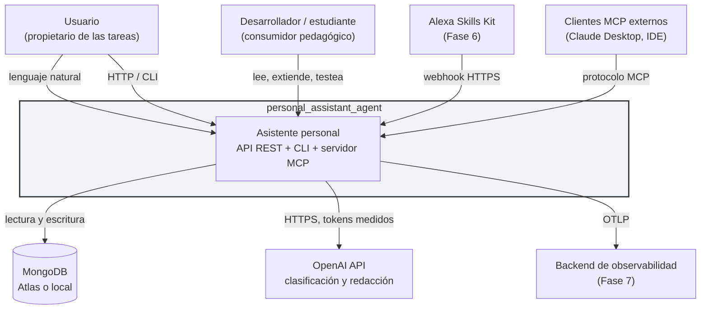
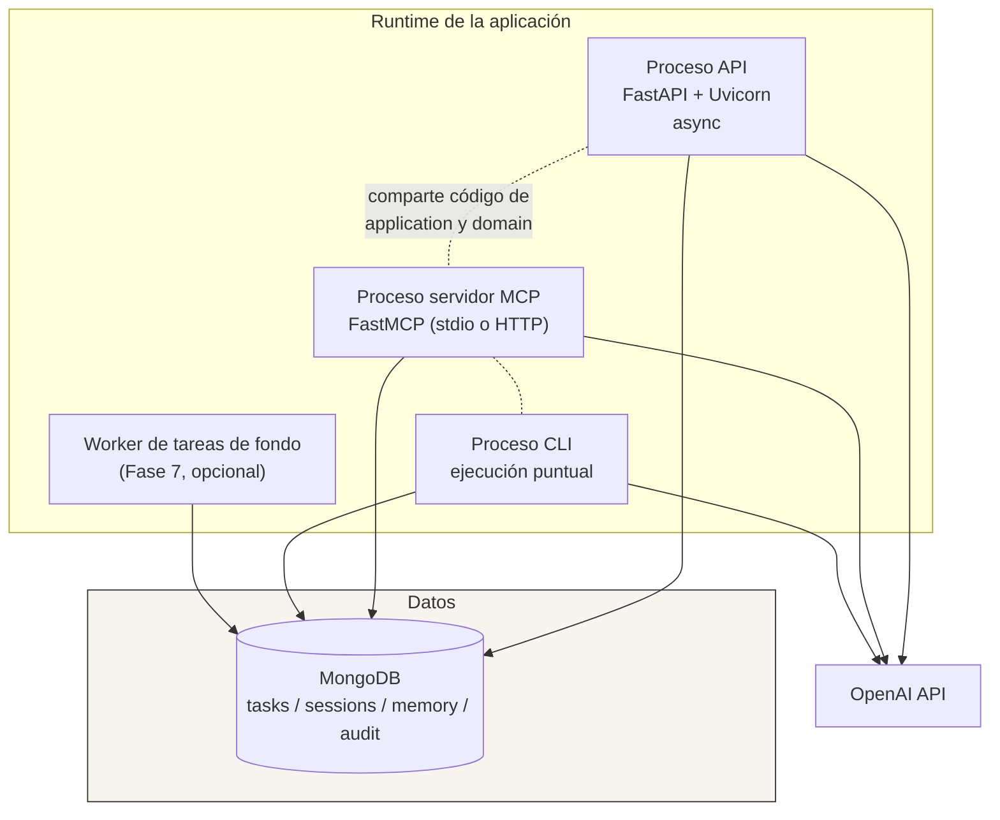
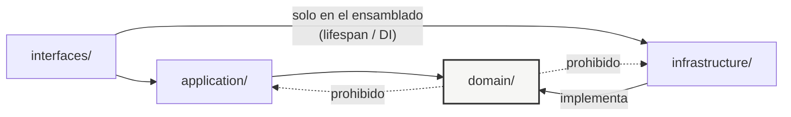
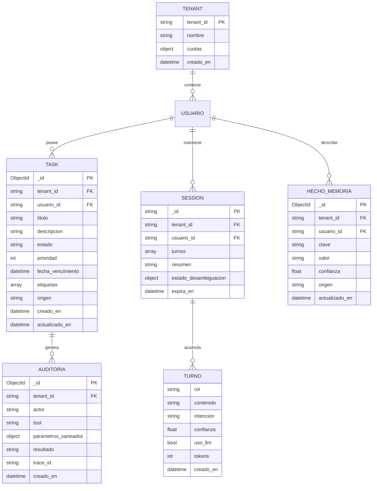
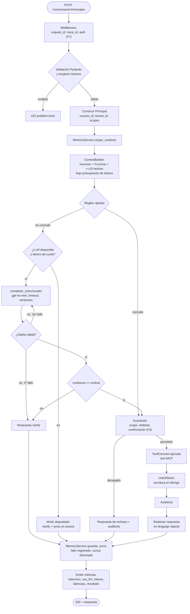

# Arquitectura de Soluciones y Arquitectura Técnica

**Proyecto:** `personal_assistant_agent`
**Versión del documento:** 1.0
**Ámbito:** describe la solución objetivo consolidada (Fases 0–4 como línea base implementable, con puntos
de extensión marcados para Fases 5–8). Complementa el Anexo A (*Arquitectura objetivo industrializada*),
que aporta el roadmap y la clasificación de propuestas; este documento aporta la **especificación**:
componentes, contratos, modelo de datos, estructura de código y decisiones registradas.

**Cómo se relacionan los dos documentos**

| Documento | Responde a |
| --- | --- |
| Anexo A | ¿Qué adoptar, en qué fase, y con qué criterio? |
| Este documento | ¿Cómo está construido el sistema y cuáles son sus contratos? |

---

# PARTE I — ARQUITECTURA DE SOLUCIONES

## 1. Objetivo y alcance de la solución

**Problema que resuelve.** Gestionar tareas personales por dos vías equivalentes: una API REST para
integraciones y un flujo conversacional en lenguaje natural, con memoria entre turnos, preparado para
canales de voz y clientes de agentes.

**Doble objetivo, y el orden importa.** El sistema es un producto funcional *y* un vehículo pedagógico.
Cuando ambos objetivos entren en conflicto, gana la legibilidad: se prefiere el diseño explicable al
diseño óptimo, salvo que la diferencia sea de corrección y no de elegancia.

**Dentro del alcance (línea base):** CRUD y búsqueda de tareas; clasificación de intención; orquestación
de acciones; memoria de sesión y de perfil; exposición de tools por MCP; CLI y API REST.

**Fuera del alcance de la línea base:** colaboración multiusuario en tiempo real; calendario externo;
notificaciones push; RAG (condicionado, §I.5); autenticación de usuarios finales (Fase 7).

## 2. Capacidades de negocio y su realización técnica

| Capacidad | Realización | Componente responsable |
| --- | --- | --- |
| Capturar una tarea en lenguaje natural | Clasificación de intención + extracción de entidades + tool MCP | `IntentRouter` → `TaskOrchestrator` → `crear_tarea` |
| Consultar tareas con filtros | Query estructurada sobre Mongo, sin LLM | `TaskService` → `TaskRepository` |
| Completar / actualizar tareas | Tool MCP idempotente | `TaskService` |
| Buscar por texto | Índice de texto de Mongo (`$text`) tras el port de búsqueda | `DocumentSearchRepository` |
| Mantener el hilo de la conversación | Memoria de sesión con TTL + resumen incremental | `MemoryService` |
| Recordar preferencias estables | Memoria de perfil con extracción explícita | `MemoryService` |
| Desambiguar en vez de adivinar | Intención `clarify` como salida de primera clase | `IntentRouter` |
| Ser consumido por agentes externos | Servidor MCP con tools tipadas | `interfaces/mcp` |
| Atender por voz (Fase 6) | Adaptador de canal, mismo orquestador | `interfaces/alexa` |

**Regla de oro de la solución:** una capacidad se implementa **una sola vez**, en `application/`, y se
expone por tantos adaptadores como canales existan. Ningún canal contiene reglas de negocio.

## 3. Contexto del sistema (C4 nivel 1)



**Dependencias externas y su criticidad**

| Dependencia | Criticidad | Degradación si cae |
| --- | --- | --- |
| MongoDB | **Crítica** | El sistema no opera. No hay modo offline. |
| OpenAI API | **Degradable** | Modo solo-reglas: se atienden las intenciones cubiertas por reglas y el resto responde `clarify`. Se comunica al usuario. |
| Backend de observabilidad | No crítica | Se pierde telemetría, nunca se bloquea una petición por fallo de export. |

Que la caída del LLM sea *degradable* y no *crítica* es una propiedad de diseño: es la consecuencia
directa de haber puesto las reglas antes del modelo.

## 4. Contenedores y despliegue (C4 nivel 2)



**Topología de despliegue por entorno**

| Entorno | API | Mongo | LLM | Observabilidad |
| --- | --- | --- | --- | --- |
| Local | `uv run uvicorn --reload` | `docker compose up mongo` | Real o cliente grabado | Logs JSON a stdout |
| CI | `httpx.AsyncClient` en proceso | Service container efímero | Grabado (VCR); real solo en `eval-router` | stdout |
| Staging (Fase 7) | Contenedor en PaaS, 1 instancia | Atlas tier gratuito | Real, con cuota | OTLP → backend |
| Producción (Fase 8) | Contenedor, 2+ instancias sin estado | Atlas con backups | Real, con cuota por tenant | OTLP + métricas |

**Los tres procesos comparten el mismo paquete instalado.** No hay copias de lógica ni submódulos
duplicados: esa es la razón principal por la que el empaquetado (`pyproject.toml`) es un prerrequisito
estructural y no una comodidad.

## 5. Decisiones de solución registradas (ADR resumidos)

Formato compacto: contexto → decisión → consecuencia aceptada. Los criterios de reevaluación están en el
Anexo A.

**ADR-01 — Arquitectura hexagonal estricta por capas.**
El dominio no conoce infraestructura; toda dependencia externa entra por un Protocol.
*Consecuencia aceptada:* más ficheros y más indirección que un diseño plano. Se acepta porque es el
contenido pedagógico central y porque hace reversibles las decisiones de stack.

**ADR-02 — Router híbrido (reglas → LLM pequeño → `clarify`) en lugar de agente autónomo.**
*Consecuencia:* hay que escribir código explícito por intención; a cambio el coste es acotado, el
comportamiento es predecible y la calidad es medible con un dataset.

**ADR-03 — MCP como capa canónica de tools.**
Toda acción se ejecuta a través de una tool MCP, también cuando la invoca el orquestador interno.
*Consecuencia:* una indirección adicional en el camino de ejecución; a cambio, cero duplicación de reglas
entre canales y libertad para cambiar quién invoca las tools sin reescribir negocio.

**ADR-04 — MongoDB como único almacén.**
Documentos, sesiones, memoria y (si algún día aplica) vectores viven en el mismo motor.
*Consecuencia:* se renuncia a capacidades relacionales; a cambio, una sola tecnología de datos que
aprender, operar y respaldar.

**ADR-05 — Async de extremo a extremo.**
Nada de bridging sync/async dentro del event loop; el cliente LLM pasa a `AsyncOpenAI`; los adaptadores
inevitablemente síncronos se aíslan con `asyncio.to_thread`.
*Consecuencia:* obliga a tocar el cliente OpenAI y el repositorio de memoria. Es lo que cierra el bug de
persistencia silenciosa.

**ADR-06 — `tenant_id` presente desde el día uno con valor `"default"`.**
*Consecuencia:* un parámetro más en firmas y documentos hoy, en lugar de una migración con riesgo en
Fase 8.

**ADR-07 — `clarify` es una respuesta correcta, no un fallo.**
Se mide como métrica de calidad con una banda objetivo, no como error.
*Consecuencia:* el asistente pregunta más de lo que preguntaría un sistema que adivina. Se considera
preferible a la acción incorrecta silenciosa.

**ADR-08 — Español como idioma de código, comentarios y datos de dominio.**
*Consecuencia:* mezcla con nombres de librerías en inglés. Convención: identificadores propios en español,
API de terceros tal cual.

---

# PARTE II — ARQUITECTURA TÉCNICA

## 6. Estructura de código

```
personal_assistant_agent/
├── pyproject.toml              # metadatos, dependencias, config de ruff/mypy/pytest
├── uv.lock
├── .env.example
├── docker-compose.yml          # Fase 0: solo mongo. Fase 7: api + mongo + collector
├── Dockerfile                  # Fase 7, multi-stage
├── AGENTS.md                   # principios no negociables
├── docs/
│   ├── arquitectura_y_prd.md   # fuente de verdad
│   ├── anexo_arquitectura_objetivo.md
│   └── arquitectura_soluciones_y_tecnica.md
├── src/asistente/
│   ├── domain/                 # sin imports de otras capas. Sin I/O. Sin librerías externas.
│   │   ├── entidades/          # Task, Session, TurnoConversacion, HechoMemoria, Tenant, Principal
│   │   ├── valores/            # EstadoTarea, Prioridad, Intencion, NivelConfianza
│   │   ├── puertos/            # Protocols (§7)
│   │   └── errores.py          # taxonomía de errores de dominio (§11)
│   ├── application/            # casos de uso. Depende solo de domain.
│   │   ├── task_service.py
│   │   ├── task_orchestrator.py
│   │   ├── intent_router.py
│   │   ├── memory_service.py
│   │   ├── context_builder.py
│   │   ├── guardrails.py       # Fase 4
│   │   └── dto/                # entrada y salida de casos de uso
│   ├── infrastructure/         # implementa los puertos. Único lugar con I/O.
│   │   ├── config/settings.py  # pydantic-settings, única fuente de configuración
│   │   ├── mongo/              # cliente, repositorios, índices, migraciones
│   │   ├── llm/                # AsyncOpenAI, reintentos, contador de tokens, prompts versionados
│   │   ├── mcp/tools/          # implementación de tools
│   │   └── observabilidad/     # structlog, OTel, context vars
│   └── interfaces/             # adaptadores de entrada. Sin reglas de negocio.
│       ├── api/                # app.py, routers, dependencias, middleware, handlers
│       ├── cli/
│       ├── mcp_server/
│       └── alexa/              # Fase 6
└── tests/
    ├── unit/                   # sin I/O
    ├── integration/            # Mongo real, marca @pytest.mark.integration
    ├── contract/               # esquemas de tools MCP, Fase 3
    ├── e2e/                    # httpx.AsyncClient + Mongo
    └── eval/
        ├── golden_router.jsonl
        ├── umbrales.yaml
        └── test_eval_router.py
```

**Reglas de dependencia, verificables en CI**



Se aplican como test automático (import-linter o un test que inspeccione los imports):

- `domain/` no importa `application`, `infrastructure` ni `interfaces`, ni librerías de I/O.
- `application/` no importa `infrastructure` ni `interfaces`.
- `infrastructure/` no importa `interfaces`.
- El **único** punto donde se conocen las implementaciones concretas es el ensamblado de dependencias en el
  `lifespan` de FastAPI (y su equivalente en CLI y MCP).

## 7. Puertos y adaptadores

Todo puerto es un `typing.Protocol` en `domain/puertos`. Ningún caso de uso conoce una clase concreta.

| Puerto | Métodos principales | Adaptador base | Adaptadores alternativos |
| --- | --- | --- | --- |
| `TaskRepository` | `crear`, `obtener`, `listar`, `actualizar`, `eliminar` | `MongoTaskRepository` | `InMemoryTaskRepository` (tests) |
| `SessionMemoryRepository` | `cargar_sesion`, `añadir_turno`, `guardar_resumen`, `purgar` | `MongoSessionRepository` (async puro) | `InMemory…` (tests) |
| `LongTermMemoryRepository` | `leer_hechos`, `upsert_hecho`, `olvidar_usuario` | `MongoMemoryRepository` (Fase 2) | `InMemory…` |
| `DocumentSearchRepository` | `buscar(consulta, filtros, limite)` | `MongoTextSearchRepository` (`$text`) | `AtlasVectorSearchRepository` (Fase 5, condicional) |
| `LLMClient` | `completar`, `completar_estructurado`, `contar_tokens` | `AsyncOpenAIClient` | `GrabadoLLMClient` (VCR, CI), `FakeLLMClient` |
| `IntentRouter` | `clasificar(mensaje, contexto)` | `ProductionIntentRouter` | `ReglasSoloRouter` (modo degradado) |
| `ToolExecutor` | `listar_tools`, `ejecutar(nombre, args, principal)` | `McpToolExecutor` | `DirectToolExecutor` (tests) |
| `Clock` | `ahora()` | `SystemClock` | `FrozenClock` (tests) |
| `UnitOfWork` | `__aenter__`, `commit`, `rollback` | `MongoUnitOfWork` (sesiones de Mongo) | `NoopUnitOfWork` |

Dos puertos merecen justificación porque no son obvios:

- **`Clock`.** Sin él, cualquier lógica de vencimientos y TTL es intestable sin `freezegun`. Coste: cinco
  líneas.
- **`LLMClient` con `completar_estructurado`.** Separar la llamada estructurada de la libre permite que la
  validación Pydantic y la política de reintento ante salida inválida vivan en un solo sitio, en vez de
  repetirse en cada uso.

## 8. Modelo de datos



**Colecciones e índices**

| Colección | Índices | Notas |
| --- | --- | --- |
| `tareas` | `{tenant_id:1, usuario_id:1, estado:1, fecha_vencimiento:1}`, `{tenant_id:1, etiquetas:1}`, texto en `{titulo, descripcion}` | `tenant_id` **siempre primero**: determina el rendimiento de toda consulta futura |
| `sesiones` | `{tenant_id:1, usuario_id:1}`, TTL en `expira_en` | `_id` = `session_id` legible. TTL de 30 días por defecto |
| `memoria_larga` | único `{tenant_id:1, usuario_id:1, clave:1}` | El índice único es lo que convierte la escritura en `upsert` idempotente |
| `auditoria` | `{tenant_id:1, creado_en:-1}`, TTL configurable | Parámetros **saneados**: nunca secretos ni texto íntegro del usuario |

**Convenciones de datos**

- Fechas en UTC, siempre `datetime` con zona; la conversión a hora local es responsabilidad de
  `interfaces/`.
- Sin borrado físico de tareas: `estado = "eliminada"` más TTL. Permite deshacer y auditar.
- Los turnos viven **embebidos** en la sesión (se leen siempre juntos, son acotados por el resumen
  incremental); los hechos de memoria viven en colección aparte (se consultan por clave y crecen sin
  límite natural). El criterio es el patrón de acceso, no la estética del esquema.
- Migraciones de esquema como scripts numerados idempotentes en `infrastructure/mongo/migraciones/`,
  ejecutados en el arranque tras comparar una versión de esquema almacenada.

## 9. Contratos de interfaz

### 9.1 API REST

| Método | Ruta | Propósito | Notas |
| --- | --- | --- | --- |
| `GET` | `/health` | Liveness | Sin dependencias |
| `GET` | `/ready` | Readiness | Comprueba Mongo; usado por `HEALTHCHECK` |
| `POST` | `/tareas` | Crear tarea | `201` + `Location` |
| `GET` | `/tareas` | Listar con filtros y paginación | `estado`, `etiqueta`, `vence_antes`, `limite`, `cursor` |
| `GET` | `/tareas/{id}` | Obtener una | `404` si no existe **o no es del tenant** |
| `PATCH` | `/tareas/{id}` | Actualizar parcialmente | Idempotente |
| `POST` | `/tareas/{id}/completar` | Completar | Idempotente: recompletar devuelve `200` |
| `DELETE` | `/tareas/{id}` | Borrado lógico | `204` |
| `POST` | `/conversacion/mensajes` | Turno conversacional | Cuerpo: `mensaje`, `session_id?`. Devuelve respuesta, `intencion`, `acciones`, `session_id` |
| `DELETE` | `/usuarios/{id}/datos` | Derecho al olvido | Fase 8; cascada en todas las colecciones |

**Detalle importante:** un recurso de otro tenant devuelve `404`, nunca `403`. Un `403` confirmaría la
existencia del recurso y filtraría información entre tenants.

Errores: `application/problem+json` con `type`, `title`, `status`, `detail` genérico, `request_id`.
Versionado por prefijo `/v1` desde el momento en que exista el primer consumidor externo (Alexa, Fase 6).

### 9.2 Tools MCP

Cada tool declara nombre, esquema de entrada Pydantic, esquema de salida, scope exigido y si es idempotente.

| Tool | Entrada | Scope | Idempotente | Efecto |
| --- | --- | --- | --- | --- |
| `crear_tarea` | `titulo`, `descripcion?`, `fecha_vencimiento?`, `prioridad?`, `etiquetas?` | `tareas:escribir` | No | Inserta |
| `listar_tareas` | `estado?`, `etiqueta?`, `vence_antes?`, `limite<=50` | `tareas:leer` | Sí | Lee |
| `buscar_tareas` | `consulta`, `limite<=20` | `tareas:leer` | Sí | Lee |
| `actualizar_tarea` | `id`, campos parciales | `tareas:escribir` | Sí | Actualiza |
| `completar_tarea` | `id` | `tareas:escribir` | Sí | Actualiza estado |
| `eliminar_tarea` | `id` | `tareas:eliminar` | Sí | Borrado lógico, requiere confirmación |

**Invariantes de seguridad de las tools (no negociables):**

1. `tenant_id` y `usuario_id` los inyecta el servidor desde el `Principal`. **Nunca son parámetros del
   esquema.** Es la mitigación estructural contra la inyección de prompt: el modelo no puede pedir lo que
   no puede nombrar.
2. Sin filtros arbitrarios ni fragmentos de query como entrada. Solo campos enumerados y tipados.
3. `limite` con techo duro en el esquema, no en la implementación.
4. Toda invocación escribe una entrada en `auditoria` con `trace_id`.
5. Las tools destructivas exigen confirmación explícita en el flujo conversacional.

### 9.3 Contrato de salida del router

Objeto Pydantic validado, nunca texto libre parseado:

```
IntencionDetectada:
  intencion: Literal["crear","listar","buscar","actualizar","completar","eliminar","clarify","fuera_de_dominio"]
  confianza: float  # 0..1
  entidades: dict   # validado por intención
  origen: Literal["reglas","llm"]
  version_prompt: str | None
  tokens: int
```

Política ante salida inválida: **un** reintento incluyendo el error de validación como contexto; si vuelve
a fallar, `clarify`. Nunca se propaga una salida no validada a la ejecución.

## 10. Flujo de ejecución detallado



**Presupuestos objetivo por interacción** (medidos, no aspiracionales):

| Ruta | Latencia p95 objetivo | Coste LLM |
| --- | --- | --- |
| Resuelta por reglas | < 150 ms | 0 |
| Con clasificación LLM | < 1.500 ms | ~300–600 tokens |
| Con agente de fallback (F4) | < 5.000 ms, máx. 5 pasos | acotado por presupuesto |

## 11. Taxonomía de errores

Los errores se definen en `domain/errores.py` y se traducen a HTTP **solo** en `interfaces/`. El dominio no
conoce códigos de estado.

| Error de dominio | HTTP | Reintentable | Se registra como |
| --- | --- | --- | --- |
| `ErrorValidacion` | 422 | No | `warning` |
| `TareaNoEncontrada` | 404 | No | `info` |
| `AccesoDenegado` | 404 (deliberado, §9.1) | No | `warning` + auditoría |
| `ConflictoConcurrencia` | 409 | Sí | `info` |
| `CuotaAgotada` | 429 | Sí, con espera | `warning` |
| `ErrorProveedorLLM` | 503 | Sí, con backoff | `error` |
| `ErrorPersistencia` | 503 | Depende | `error` |
| `ErrorInesperado` | 500 | No | `exception` con traza en log, **nunca en la respuesta** |

Regla: la respuesta al cliente lleva mensaje genérico y `request_id`; el detalle vive en los logs. Un
stacktrace en el cuerpo es filtración de arquitectura.

## 12. Requisitos no funcionales

| Atributo | Objetivo | Cómo se verifica |
| --- | --- | --- |
| Corrección de persistencia | 0 escrituras silenciosamente perdidas | Integration test de ida y vuelta por repositorio |
| Latencia | Según §10 | Histogramas por tramo en métricas |
| Coste | Coste medio por interacción conocido y con tendencia visible | Métrica de tokens por interacción |
| Calidad del router | Accuracy ≥ umbral, `clarify` dentro de banda | Job `eval-router` en CI |
| Disponibilidad | Degradación explícita sin LLM; sin modo degradado para Mongo | Test con `LLMClient` que falla |
| Seguridad | 0 rutas de acceso cruzado entre tenants | Test que intenta leer datos de otro tenant |
| Trazabilidad | Toda interacción reconstruible desde logs | `request_id` en el 100 % de los logs de la petición |
| Mantenibilidad | Reglas de dependencia entre capas siempre respetadas | Test de imports en CI |
| Reproducibilidad | Clone → un comando → tests en verde | Job de CI en runner limpio |

## 13. Estrategia de configuración e inyección de dependencias

Una sola clase `Settings` (`pydantic-settings`) instanciada una vez y cacheada. Ensamblado en el `lifespan`:

```
lifespan:
  1. cargar y validar Settings         -> falla ruidosamente si falta algo
  2. abrir AsyncIOMotorClient          -> ping, aplicar migraciones e índices
  3. construir adaptadores             -> repositorios, LLMClient, ToolExecutor
  4. construir casos de uso            -> inyectando puertos, no clases concretas
  5. publicar en app.state             -> los Depends solo leen de ahí
  ...
  6. cierre ordenado                   -> flush de telemetría, cerrar cliente Mongo
```

Los `Depends` de FastAPI **no construyen nada**: solo leen de `app.state`. Así el coste de arranque se paga
una vez, los tests pueden sustituir cualquier puerto con un `dependency_overrides`, y hay un único lugar en
todo el repositorio donde se ve el grafo completo de dependencias — que es, además, el mejor punto de
entrada para alguien que llega nuevo al código.

CLI y servidor MCP usan la **misma** función de ensamblado, sin duplicarla.

## 14. Puntos de extensión previstos

Cada uno está diseñado para ser un cambio **local**: nuevo adaptador, cero cambios en `application/`.

| Extensión | Fase | Qué se añade | Qué NO cambia |
| --- | --- | --- | --- |
| Agente de fallback con tools | 4 | `AgentToolExecutor` + guardrails | Router, tools, repositorios |
| Motor de grafo de estados | 4+, condicional | Adaptador del puerto de orquestación | Casos de uso, dominio |
| Búsqueda vectorial | 5, condicional | `AtlasVectorSearchRepository` | Puerto de búsqueda, casos de uso |
| Canal Alexa | 6 | `interfaces/alexa` + política de respuesta breve | Orquestador, tools |
| Multi-tenancy real | 8 | Filtro obligatorio en el repositorio base | Firmas de casos de uso (ya llevan `tenant_id`) |
| Proveedor LLM alternativo | Cualquiera | Otro adaptador de `LLMClient` | Todo lo demás |

Que esta tabla pueda escribirse con una columna «qué NO cambia» tan amplia es la única justificación real
del coste de la arquitectura hexagonal. Si en algún momento deja de poder escribirse así, la abstracción ha
dejado de pagar y hay que revisarla.

## 15. Definition of Done de la arquitectura técnica

- [ ] El paquete se instala y los tres procesos (API, CLI, MCP) arrancan desde el mismo paquete.
- [ ] Un test de CI verifica las reglas de dependencia entre capas.
- [ ] Todo puerto tiene al menos dos adaptadores: el real y uno de test.
- [ ] Existe un integration test de ida y vuelta por cada repositorio contra Mongo real.
- [ ] Todos los índices declarados en §8 se crean en el arranque de forma idempotente.
- [ ] Ninguna tool MCP acepta `tenant_id` como parámetro de entrada.
- [ ] Un test comprueba que acceder a un recurso de otro tenant devuelve `404`.
- [ ] Los errores de dominio se traducen a HTTP solo en `interfaces/` y sin filtrar internals.
- [ ] El router devuelve un objeto validado; una salida inválida nunca llega a la ejecución.
- [ ] Toda interacción emite las métricas de §10 con el `request_id` de la petición.
- [ ] `docs/arquitectura_y_prd.md` referencia este documento y se actualiza con cada cambio de diseño.
