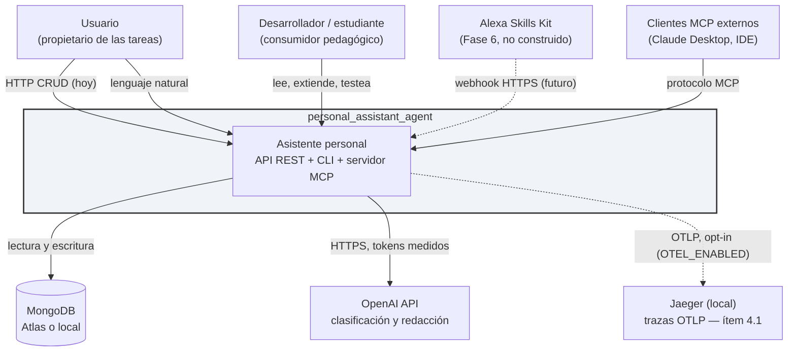
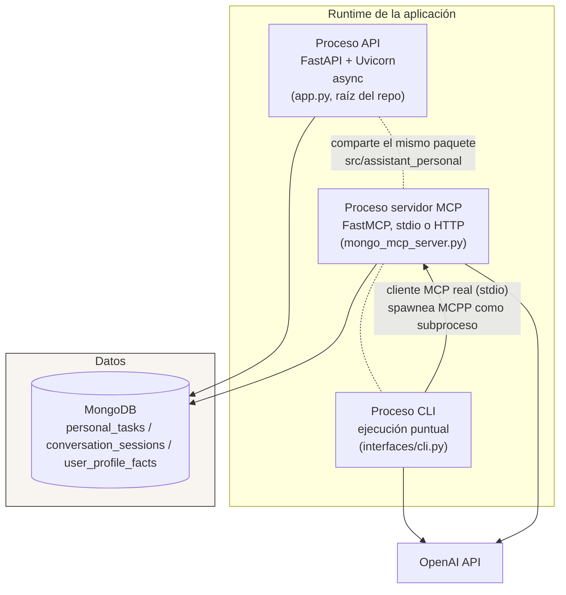
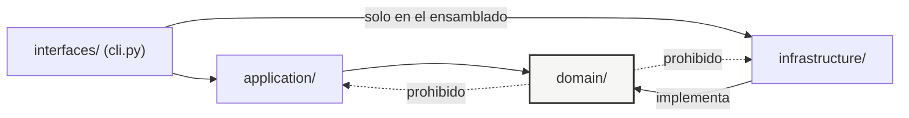
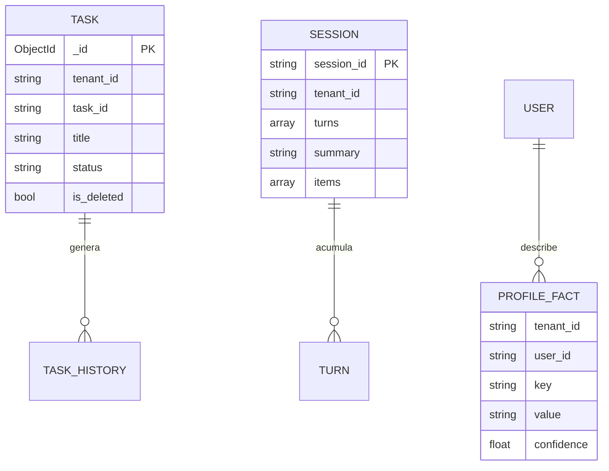
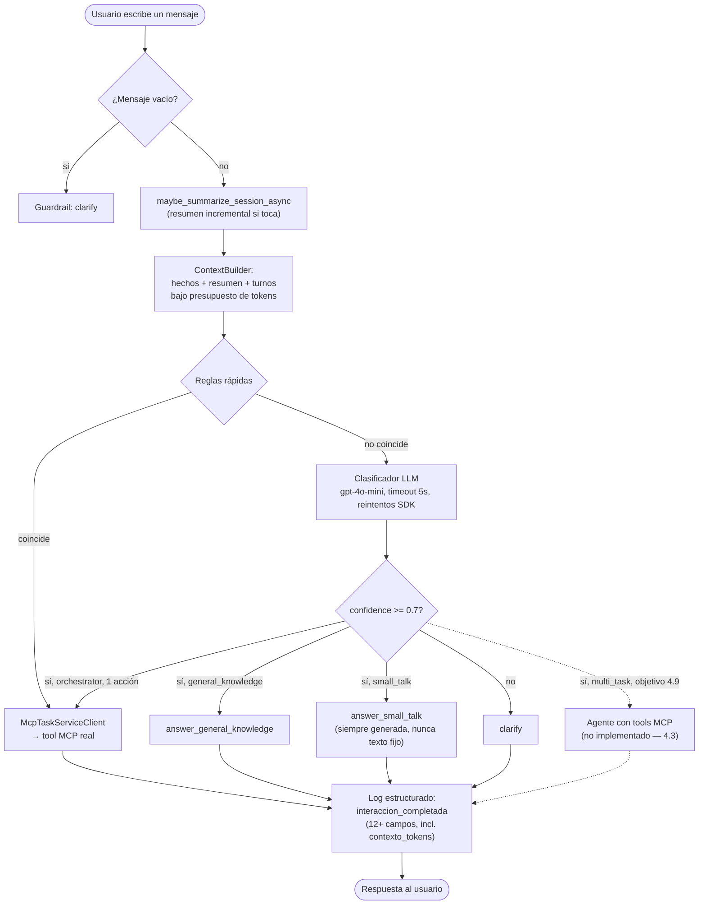

# Arquitectura de Soluciones y Arquitectura Técnica

**Proyecto:** `personal_assistant_agent`
**Versión del documento:** 2.0 — resincronizado con la implementación real (2026-08-19)
**Ámbito:** describe la solución objetivo consolidada (Fases 0–4 como línea base implementable, con puntos
de extensión marcados para Fases 5–8). Complementa el Anexo A (`docs/anexo_arquitectura_objetivo.md`), que
es la **fuente de verdad operativa**: lleva el roadmap fase a fase, el estado de cada ítem (hecho/pendiente)
y la evidencia de cada cambio. Este documento describe **cómo está construido el sistema hoy** y hacia dónde
apunta — cuando un componente todavía no existe, se marca explícitamente como *(objetivo, no implementado)*
en vez de describirlo como si ya existiera.

**Cómo se relacionan los dos documentos**

| Documento | Responde a |
| --- | --- |
| Anexo A (`anexo_arquitectura_objetivo.md`) | ¿Qué falta, en qué fase, con qué evidencia de que está hecho? |
| Este documento | ¿Cómo está construido el sistema y cuáles son sus contratos, hoy? |

Si algo diverge entre los dos, el Anexo A gana — es el que se actualiza en cada sesión de trabajo.

---

# PARTE I — ARQUITECTURA DE SOLUCIONES

## 1. Objetivo y alcance de la solución

**Problema que resuelve.** Gestionar tareas personales por varios canales equivalentes: hoy una API REST
para integraciones y un CLI conversacional; a futuro un frontend propio y un canal de voz (Alexa, Fase 6).
Todos comparten la misma memoria de sesión/perfil y la misma capa de ejecución MCP.

**Orden de construcción, explícito y deliberado.** El sistema se construye de adentro hacia afuera: primero
la infraestructura conversacional (router → orquestador → MCP → memoria), después el agente que la
complementa (Fase 4), y solo entonces los canales de cara al usuario (frontend propio, Alexa). Hoy **no
existe todavía ningún canal conversacional expuesto por HTTP** — `app.py` es CRUD estructurado puro; el
único consumidor del orquestador es el CLI. Esto es una secuencia intencional, no una omisión: exponer un
canal antes de que el router+agente+MCP estén completos obligaría a reconstruirlo dos veces.

**Doble objetivo, y el orden importa.** El sistema es un producto funcional *y* un vehículo pedagógico.
Cuando ambos objetivos entren en conflicto, gana la legibilidad: se prefiere el diseño explicable al
diseño óptimo, salvo que la diferencia sea de corrección y no de elegancia.

**Dentro del alcance (línea base):** CRUD y búsqueda de tareas; clasificación de intención (incluida
`multi_task` para mensajes con varias acciones); orquestación de acciones; memoria de sesión y de perfil;
exposición de tools por MCP como única vía de ejecución; CLI y API REST; endpoint conversacional en
lenguaje natural (precondición de cualquier frontend o canal de voz).

**Fuera del alcance de la línea base:** colaboración multiusuario en tiempo real; calendario externo;
notificaciones push; RAG (condicionado, §I.5); autenticación de usuarios finales (Fase 7); Alexa (Fase 6,
construible recién cuando el endpoint conversacional de §9.1 exista).

## 2. Capacidades de negocio y su realización técnica

| Capacidad | Realización | Componente responsable |
| --- | --- | --- |
| Capturar una tarea en lenguaje natural | Clasificación de intención + extracción de entidades + tool MCP | `ProductionIntentRouter` → `TaskOrchestrator` → `McpTaskServiceClient` → tool `crear_tarea` |
| Capturar varias tareas/acciones en un mensaje | Ruta `multi_task` del router, descompuesta por el agente *(objetivo, Fase 4 — ítem 4.9)* | `ProductionIntentRouter` → agente con tools MCP |
| Consultar tareas con filtros | Query estructurada sobre Mongo, sin LLM | `TaskService` → `MongoTaskRepository` |
| Completar / actualizar tareas | Tool MCP | `TaskService` vía tool `completar_tarea`/`actualizar_tarea` |
| Buscar por texto | Índice de texto de Mongo (`$text`) tras el port de búsqueda | `DocumentSearchRepository` |
| Mantener el hilo de la conversación | Memoria de sesión con resumen incremental bajo presupuesto de tokens | `ShortTermMemory` + `ContextBuilder` |
| Recordar preferencias estables | Memoria de perfil con extracción explícita gated por confianza | `LongTermMemory` |
| Desambiguar en vez de adivinar | Intención `clarify` como salida de primera clase | `ProductionIntentRouter` |
| Ser consumido por agentes externos | Servidor MCP con tools tipadas (stdio o HTTP) | `infrastructure/mcp/server.py` |
| Responder en lenguaje natural a un frontend o canal de voz | Endpoint conversacional *(objetivo, no implementado — ítem 4.10)* | `app.py` → `TaskOrchestrator` |
| Atender por voz (Fase 6) | Adaptador de canal, mismo orquestador *(objetivo, no implementado)* | `interfaces/alexa.py` |

**Regla de oro de la solución:** una capacidad se implementa **una sola vez**, en `application/`, y se
expone por tantos adaptadores como canales existan. Ningún canal contiene reglas de negocio. Hoy esto es
cierto para el camino conversacional (CLI); `app.py` todavía es la excepción (CRUD directo, ver ADR-03).

## 3. Contexto del sistema (C4 nivel 1)



**Dependencias externas y su criticidad**

| Dependencia | Criticidad | Degradación si cae |
| --- | --- | --- |
| MongoDB | **Crítica** | El sistema no opera. No hay modo offline. |
| OpenAI API | **Degradable** | Modo solo-reglas: se atienden las intenciones cubiertas por reglas y el resto responde `clarify`. |
| Jaeger (trazas) | No crítica, opt-in (`OTEL_ENABLED`) | Se pierden trazas; `BatchSpanProcessor` absorbe el fallo del exporter, nunca bloquea una petición. |

Que la caída del LLM sea *degradable* y no *crítica* es una propiedad de diseño real, ya verificada: las
reglas rápidas del router (`hybrid_router._check_fast_rules`) resuelven una parte del tráfico sin tocar el
LLM.

## 4. Contenedores y despliegue (C4 nivel 2)



**Esto ya es real, no aspiracional (ítem 3.1):** el CLI no llama a `TaskService` en proceso — abre una
conexión MCP real por stdio contra `mongo_mcp_server.py` como subproceso, y ejecuta las tools declaradas
(`crear_tarea`, `listar_tareas`, `completar_tarea`). `app.py` sigue llamando a `TaskService` directo (no
pasa por MCP) porque expone CRUD estructurado, no un canal conversacional — ver ADR-03 y el ítem 4.10.

**Topología de despliegue por entorno**

| Entorno | API | Mongo | LLM | Observabilidad |
| --- | --- | --- | --- | --- |
| Local | `uv run uvicorn app:app --reload` | `docker compose up mongo` (puerto 27018) | Real | Logs JSON a stdout (`structlog`) |
| CI | `httpx.AsyncClient` en proceso (`test_api_e2e.py`) | Service container efímero | Real solo en `eval-router.yml`; dummy en `ci.yml` | stdout |
| Producción (futuro) | Sin definir todavía | Atlas | Real, con cuota | Sin definir (Fase 7) |

**Los tres procesos comparten el mismo paquete instalado** (`src/assistant_personal/`), pero **no** un
único punto de ensamblado de dependencias todavía — `app.py`, `cli.py` y `server.py` cada uno construye sus
propios adaptadores por defecto de forma independiente. Unificarlo en un solo `lifespan`/factory
compartido es una mejora de mantenibilidad razonable, no bloqueante hoy.

## 5. Decisiones de solución registradas (ADR resumidos)

**ADR-01 — Arquitectura hexagonal por capas.** ✅ Vigente.
`domain/` no conoce infraestructura; toda dependencia externa entra por un `Protocol` en
`domain/repositories/`. *Consecuencia aceptada:* más ficheros y más indirección que un diseño plano — se
acepta porque es el contenido pedagógico central y porque hace reversibles las decisiones de stack.

**ADR-02 — Router híbrido (reglas → LLM pequeño → `clarify`) en lugar de agente autónomo.** ✅ Vigente,
Fases 2–3. *Consecuencia:* hay que escribir código explícito por intención; a cambio el coste es acotado,
el comportamiento es predecible y la calidad es medible con un dataset (`tests/eval/golden_router.jsonl`).

**ADR-03 — MCP como capa canónica de tools.** ✅ Hecho para el camino conversacional (ítem 3.1, ver §4).
Toda acción que el orquestador ejecuta pasa por una tool MCP real (protocolo stdio), nunca por un import
directo de `TaskService`. **Pendiente:** `app.py` (CRUD HTTP) sigue siendo una excepción deliberada — no
hay decisión tomada todavía sobre si el CRUD estructurado también debe pasar por MCP o si eso solo aplica
al camino conversacional/agente (ver ítem 4.10).

**ADR-04 — MongoDB como único almacén.** ✅ Vigente.
Tareas, sesiones y memoria de perfil viven en el mismo motor (`personal_tasks`, `conversation_sessions`,
`user_profile_facts`). *Consecuencia:* se renuncia a capacidades relacionales; a cambio, una sola
tecnología de datos que aprender, operar y respaldar.

**ADR-05 — Async de extremo a extremo.** ✅ Hecho (ítem 1.6).
Sin bridging sync/async dentro del event loop; `AsyncOpenAI` de punta a punta; `MongoConnection` rebindea
el cliente Motor si el loop activo cambió.

**ADR-06 — `tenant_id` presente desde el día uno con valor `"default"`.** ✅ Hecho (ítem 1.7).

**ADR-07 — `clarify` es una respuesta correcta, no un fallo.** ✅ Vigente.
Se mide como métrica de calidad con una banda objetivo (`tasa_clarify` en `umbrales.yaml`), no como error.

**ADR-08 — Español para identificadores propios de dominio; inglés para nombres de módulo/paquete y
librerías de terceros.** ✅ Vigente, con una precisión sobre la v1.0 de este documento: el paquete raíz es
`assistant_personal` (inglés), no `asistente` — decisión tomada al iniciar el proyecto y ya con historial
de commits sobre ese nombre; renombrarlo no aporta valor funcional y tiene blast radius alto (toca
prácticamente todos los imports). Los identificadores de dominio (tools MCP, nombres de intención, mensajes
al usuario) sí están en español.

**ADR-09 — `multi_task` como ruta del router, no como excepción manejada aparte.** *(objetivo, ítem 4.9)*
Cuando el router detecta 2+ acciones de dominio en un mensaje, no inventa un esquema paralelo: usa el mismo
contrato `IntentClassification` con una ruta más. El agente de Fase 4 es quien la descompone en llamadas
MCP secuenciales. *Consecuencia:* el router se mantiene simple (clasifica, no ejecuta); la complejidad de
orquestar varios pasos vive en un solo lugar (el agente), no repartida entre el router y el orquestador.

**ADR-10 — Router vs. agente: la línea es "¿requiere interpretar lenguaje natural?", no lectura vs.
escritura.** *(objetivo, ítem 4.11)* El router (regla dura o clasificador de alta confianza) solo invoca
una tool MCP directo cuando ya tiene el 100% de los parámetros sin interpretar nada ("lista mis tareas" sin
filtros, "completa la tarea `<id>`"). Cualquier caso que exija estructurar datos desde lenguaje natural —
filtros de fecha/estado en una lectura, título/descripción al crear, referencia ambigua al completar o
borrar — pasa por el agente, sea lectura o escritura. No confundir con ADR-03: "todo pasa por MCP" es sobre
el transporte (nadie toca Mongo salvo vía tool), esto es sobre quién decide qué parámetros usar.

---

# PARTE II — ARQUITECTURA TÉCNICA

## 6. Estructura de código

Árbol:

```
personal_assistant_agent/
├── pyproject.toml              # metadatos, dependencias, config de ruff/mypy/pytest
├── uv.lock
├── .env.example
├── docker-compose.yml          # Mongo local desechable, puerto 27018
├── app.py                      # entrypoint FastAPI — CRUD de tareas, en la raíz por simplicidad
│                                # de `uvicorn app:app`. Candidato a mover bajo interfaces/ (ver §14)
├── mongo_mcp_server.py          # entrypoint del servidor MCP (stdio)
├── .github/workflows/           # ci.yml, eval-router.yml, gitleaks.yml
├── docs/
│   ├── anexo_arquitectura_objetivo.md   # fuente de verdad: roadmap + estado por ítem
│   └── arquitectura_solucion.md         # este documento
├── src/assistant_personal/
│   ├── config.py                # pydantic-settings, única fuente de configuración
│   ├── domain/                  # sin imports de otras capas, sin I/O
│   │   ├── entities.py          # ConversationRoute, IntentAction, IntentClassification, ...
│   │   ├── task_models.py       # Task y sus value objects
│   │   └── repositories/        # Protocols (puertos): task_repository, session_memory_repository,
│   │                             # long_term_memory_repository, document_search_repository, llm_client
│   ├── application/             # casos de uso, depende solo de domain — subcarpetas por sub-tema (ítem 4.15)
│   │   ├── tasks/task_service.py
│   │   ├── agent/                # orchestrator.py (TaskOrchestrator) + guardrails.py (ítem 4.2)
│   │   └── memory/                # agent_context.py (ShortTermMemory/LongTermMemory/AgentContext)
│   │                              # + context_builder.py (presupuesto de tokens + resumen incremental)
│   ├── infrastructure/          # implementa los puertos, único lugar con I/O
│   │   ├── persistence/mongo/   # cliente, repositorios, índices, build_default_task_repository
│   │   ├── routers/             # ProductionIntentRouter + clientes OpenAI del router
│   │   │                        # (candidato a separar cliente LLM genérico — ítem 4.8)
│   │   ├── mcp/                 # server.py, client.py (McpTaskServiceClient), tools/
│   │   ├── prompts/router/      # *.prompt.md versionados + loader.py
│   │   └── observabilidad/      # structlog + tracing.py (OTel, opt-in, ítem 4.1)
│   └── interfaces/
│       └── cli.py               # único adaptador de entrada conversacional hoy
└── tests/                       # plano, sin subcarpetas por tipo — la convención es el sufijo
    ├── test_*.py                 # unitarios (sin I/O externo)
    ├── test_*_integration.py     # contra Mongo real (docker-compose), @unittest.skipUnless
    ├── test_mcp_client_integration.py  # protocolo MCP real, subproceso + Mongo real
    └── eval/
        ├── golden_router.jsonl
        ├── umbrales.yaml
        └── run_eval.py            # tests/test_eval_router.py lo envuelve con @pytest.mark.eval
```

**No implementado todavía (vs. la v1.0 de este documento):** `interfaces/alexa.py` (Fase 6), un endpoint
`api/` propiamente dicho más allá de `app.py` (ítem 4.10). Tampoco existe una taxonomía de errores de
dominio centralizada (`domain/errores.py`) — hoy los handlers de `app.py` traducen excepciones ad hoc;
formalizarla es una mejora razonable, no bloqueante. `application/agent/guardrails.py` (ítem 4.2) sí existe ya
— política pura sin agente que la consuma todavía (depende de 4.3).

**Sobre `tests/` sin subcarpetas por tipo (`unit/`, `integration/`, `contract/`, `e2e/`):** es una decisión
deliberada, no una carencia. Para un proyecto de este tamaño, el patrón más común en la industria Python es
exactamente este — un directorio plano con convención de nombre (`*_integration.py`) y/o marcadores de
pytest (`@pytest.mark.eval`), no una jerarquía de carpetas por tipo de test. Migrar a subcarpetas solo
tendría sentido si el número de archivos creciera lo suficiente como para que navegar por prefijo dejara
de alcanzar (hoy: 22 archivos, lejos de ese punto).

**Reglas de dependencia entre capas**



Se respetan hoy por convención y revisión, no por un test automático que las verifique — un test de
imports que falle si `domain/` importa `infrastructure/` es una mejora pendiente razonable (§15).

## 7. Puertos y adaptadores

Todo puerto es un `typing.Protocol` en `domain/repositories/`. Los nombres son los reales del código, no
una traducción — evita el desajuste que tenía la v1.0 de este documento.

| Puerto | Métodos principales | Adaptador real | Adaptadores de test |
| --- | --- | --- | --- |
| `TaskRepository` | `create_task_async`, `get_task_async`, `list_tasks_async`, `update_task_async`, `complete_task_async` | `MongoTaskRepository` | fakes ad hoc en `test_task_service.py` |
| `SessionMemoryRepository` | `append_turn_async`, `get_context_summary_async`, `compact_session_async`, `add_context_item_async` | `MongoSessionRepository` | `InMemorySessionRepository` |
| `LongTermMemoryRepository` | `upsert_fact_async`, `get_facts_async`, `delete_facts_async` | `MongoLongTermMemoryRepository` | `InMemoryLongTermMemoryRepository` |
| `DocumentSearchRepository` | `buscar(consulta, filtros, limite)` | `MongoTextSearchRepository` (`$text`) | *(sin adaptador de test dedicado aún)* |
| `LLMClient` | `classify_intent`, `answer_general_knowledge`, `answer_small_talk`, `extract_profile_facts`, `summarize_session` | `OpenAILLMRouterClient` (agrupa 5 clientes especializados de `_OpenAITextClient`) | fakes por método en `test_hybrid_router.py` |

**Puertos propuestos en la v1.0 de este documento que NO se adoptaron** (y por qué, para no repetir la
discusión):

- **`UnitOfWork`.** Ninguna operación hoy necesita escribir en más de una colección de forma atómica; Mongo
  sin transacciones multi-documento configuradas ya cubre el caso de uso real. Adoptar solo si aparece una
  operación que sí lo requiera.
- **`Principal`/autenticación.** No hay identidad de usuario real todavía (`user_id`/`tenant_id` fijos en
  `"default"`) — es explícitamente Fase 6/7. Introducir el puerto antes tendría cero consumidores.
- **`Clock`.** Idea con mérito real (testear TTL/vencimientos sin `freezegun`), pero hoy no hay lógica de
  vencimientos que lo necesite — se evaluó como sobre-ingeniería anticipada. Si aparece esa lógica
  (recordatorios con fecha, por ejemplo), es un puerto de cinco líneas, barato de agregar entonces.
- **`ToolExecutor` como puerto separado.** La indirección ya existe, pero encarnada en `McpTaskServiceClient`
  (mismo shape que `TaskService`, ver ítem 3.1) en vez de un puerto de dominio nuevo — más simple, menos
  ceremonia para lo que hoy hace falta.

## 8. Modelo de datos



**Colecciones e índices reales** (`client.py::_ensure_task_indexes`)

| Colección | Índices | Notas |
| --- | --- | --- |
| `personal_tasks` | único `{tenant_id, task_id}`; texto en `{title, description}` | Borrado lógico: `is_deleted`/`deleted_at`, sin borrado físico |
| `conversation_sessions` | único `{tenant_id, session_id}` | `summary` + `turns` embebidos; resumen incremental los recorta (`compact_session_async`) |
| `user_profile_facts` | único `{tenant_id, user_id, key}` | El índice único es lo que vuelve `upsert_fact_async` idempotente |

**No implementado todavía:** colección `auditoria`/`audit` con `trace_id` por invocación de tool (relevante
para el ítem 3.3, Fase 3). Tampoco hay migraciones de esquema versionadas — los índices se crean
idempotentemente en el arranque, pero no hay un mecanismo de migración de datos existentes.

## 9. Contratos de interfaz

### 9.1 API REST (`app.py`)

Rutas reales hoy — CRUD estructurado, sin paso por el router ni por MCP:

| Método | Ruta | Propósito |
| --- | --- | --- |
| `GET` | `/health` | Liveness |
| `POST` | `/tasks` | Crear tarea |
| `GET` | `/tasks` | Listar tareas |
| `GET` | `/tasks/{task_id}` | Obtener una |
| `GET` | `/tasks/{task_id}/history` | Historial de cambios |
| `PATCH` | `/tasks/{task_id}` | Actualizar parcialmente |
| `DELETE` | `/tasks/{task_id}` | Borrado lógico |

Errores: handlers dedicados por tipo de excepción (`RequestValidationError`, `HTTPException`, `ValueError`,
`RuntimeError`, catch-all) devuelven un mensaje genérico + `request_id`; el detalle completo (con
traceback) solo va a los logs, nunca al cliente.

**Pendiente (ítem 4.10):** un endpoint conversacional (ej. `POST /messages`) que exponga
`TaskOrchestrator` — recibe `mensaje`/`session_id?`, devuelve una respuesta en lenguaje natural (no un
recurso JSON crudo), lista para un frontend propio o, más adelante, para servir de base a un canal de voz.

### 9.2 Tools MCP (`infrastructure/mcp/tools/task_tools.py`)

| Tool | Entrada principal | Idempotente | Efecto |
| --- | --- | --- | --- |
| `health_check` | — | Sí | Verifica conexión a Mongo |
| `listar_tareas` | `estado?`, `limite?` (default 20, techo 100) | Sí | Lee tareas activas |
| `crear_tarea` | `title`, campos opcionales del modelo de negocio | No | Inserta |
| `actualizar_tarea` | `task_id`, campos parciales | Sí | Actualiza |
| `completar_tarea` | `task_id` | Sí | Marca como completada |
| `buscar_tarea` | `task_id` | Sí | Busca una tarea puntual |
| `eliminar_tarea` | `task_id` | Sí | Elimina (soft delete) |

Cada tool declara un scope (`read`/`write`, `TOOL_SCOPES`) y audita su invocación por logger
estructurado (ítem 3.3) — metadata sin enforcement todavía, eso depende del `Principal` de Fase 6-7.
`listar_tareas`/`buscar_tarea`/`actualizar_tarea` devuelven siempre un objeto con nombres de campo
explícitos (`{"tasks": [...]}`, `{"task": {...} | None}`), no dependen del wrapping automático de
FastMCP. Los retornos están tipados con modelos Pydantic reales (`Task` del dominio más modelos de
respuesta por tool), así que el `outputSchema` que expone el protocolo MCP es real, no genérico.
`Task` tiene tres fechas de primer nivel en formato ISO 8601: `created_at` (la fija el sistema),
`due_date` (la da el usuario vía `crear_tarea`/`actualizar_tarea`, con validador que rechaza
cualquier formato no-ISO — traducir lenguaje natural a esa fecha es responsabilidad de quien llama
a la tool, no de la tool), `completed_at` (la fija `completar_tarea`, una sola vez).
**Pendiente:** el mismatch `task_reference`/`task_id` entre el prompt del router y
`TaskOrchestrator._dispatch` — completar/eliminar por descripción natural falla hoy, bloqueado hasta
que exista el agente que interprete la referencia.

**Invariantes de seguridad de las tools:**

1. `tenant_id` está fijo en `"default"` en el servidor (constructor de los repositorios), nunca es un
   parámetro que el LLM pueda fijar en el esquema de una tool.
2. Sin filtros arbitrarios ni fragmentos de query como entrada — solo campos enumerados y tipados
   (ver las firmas reales en `task_tools.py`).
3. *(objetivo, ítem 3.3)* Auditoría por invocación y scopes declarados por tool — no implementado aún.

### 9.3 Contrato de salida del router

Objeto Pydantic real (`domain/entities.py::IntentClassification`), validado con
`model_validate` — nunca texto libre parseado a mano:

```python
class IntentClassification(BaseModel):
    route: ConversationRoute  # general_knowledge | orchestrator | small_talk | clarify
                               # | multi_task (objetivo, ítem 4.9 — no existe todavía en el enum)
    intent: IntentAction | None  # solo si route == orchestrator
    confidence: float  # 0.0–1.0, nunca null
    reasoning: str | None
    source: str
    payload: dict[str, Any]
```

Política ante salida inválida: **una sola política**, sin reintento — cualquier `pydantic.ValidationError`
(enum desconocido, `confidence` fuera de rango, campo ausente) sube sin capturar hasta
`ProductionIntentRouter.route()`, que degrada a `route=clarify, source="fallback"`. Nunca se propaga una
salida no validada a la ejecución (ítem 2.1).

## 10. Flujo de ejecución detallado

Estado real del flujo conversacional (camino del CLI vía `TaskOrchestrator`, único que existe hoy):



**Presupuestos objetivo por interacción**

| Ruta | Coste LLM | Verificado |
| --- | --- | --- |
| Resuelta por reglas | 0 tokens | ✅ (`_check_fast_rules`) |
| Con clasificación LLM | ~590 tokens de prompt + variable | ✅ `eval-router` mide `coste_medio_tokens` |
| Con agente de fallback (F4) | Acotado por presupuesto de pasos | Objetivo, no implementado |

## 11. Taxonomía de errores

**Estado real:** no existe un módulo `domain/errores.py` con una taxonomía formal. `app.py` traduce
excepciones (`ValueError`, `RuntimeError`, `Exception` catch-all) a HTTP en sus propios handlers; el
orquestador captura excepciones de negocio y las convierte en respuestas `success: false` con un mensaje
redactado. La regla que sí se respeta consistentemente: **la respuesta al cliente lleva mensaje genérico +
`request_id`; el detalle (con traza) solo va a los logs.** Formalizar una taxonomía compartida en
`domain/` es una mejora de mantenibilidad razonable (§15), no bloqueante.

## 12. Requisitos no funcionales

| Atributo | Objetivo | Cómo se verifica hoy |
| --- | --- | --- |
| Corrección de persistencia | 0 escrituras silenciosamente perdidas | Integration tests de ida y vuelta contra Mongo real por repositorio |
| Coste | Coste medio por interacción conocido y con tendencia visible | `contexto_tokens` en el log + `coste_medio_tokens` en `eval-router` |
| Calidad del router | Accuracy ≥ umbral, `clarify` dentro de banda | Job `eval-router` en CI, bloqueante |
| Disponibilidad | Degradación explícita sin LLM | Reglas rápidas resuelven sin LLM; timeout/reintentos configurados en el cliente |
| Trazabilidad | Toda interacción reconstruible desde logs | `request_id` vía `structlog.contextvars` |
| Reproducibilidad | Clone → un comando → tests en verde | `uv sync && uv run pytest` (ítem 1.1) |
| Seguridad multi-tenant | *(objetivo, Fase 8)* | No verificado — `tenant_id` fijo en `"default"` hoy |

## 13. Estrategia de configuración e inyección de dependencias

Real: una sola clase `Settings` (`pydantic-settings`, `config.py`), cacheada con `@lru_cache` vía
`get_settings()`. **No hay todavía un único punto de ensamblado compartido** entre `app.py`, `cli.py` y
`mongo_mcp_server.py` — cada uno construye sus propios adaptadores por defecto de forma independiente
(mismo patrón, código separado). Unificarlo en una función de ensamblado compartida es una mejora de
mantenibilidad razonable cuando aparezca una segunda razón para tocar los tres a la vez — hoy no bloquea
nada porque los tres procesos siguen el mismo criterio (`or Adaptador()` con default real).

## 14. Puntos de extensión previstos

| Extensión | Depende de | Qué se añade | Qué NO cambia |
| --- | --- | --- | --- |
| Agente con tools (4.3) — ejecutor principal, no fallback (ver §A.8) | 3.1 (hecho), 4.2 (hecho) | `Agent` que consume `Guardrails.evaluate_step` | Router, tools MCP, repositorios |
| `multi_task` (4.9) | 4.3 | Ruta nueva en `IntentClassification` + descomposición en el agente | Contrato del router, `_dispatch` de acciones simples |
| Endpoint conversacional (4.10) | 4.3, 4.9 | Ruta HTTP que expone `TaskOrchestrator` | `TaskOrchestrator`, router, MCP |
| Canal Alexa (Fase 6) | 4.10 | `interfaces/alexa.py` + política de respuesta breve | Orquestador, tools |
| `app.py` bajo `src/` (limpieza estructural) | Ninguna, cuando se priorice | Mover el entrypoint a `interfaces/api.py` | Rutas, lógica |
| Proveedor LLM alternativo | Ninguna | Otro adaptador de `LLMClient` (ya soporta OpenAI/Ollama) | Todo lo demás |

## 15. Definition of Done de la arquitectura técnica

- [x] El paquete se instala y los tres procesos (API, CLI, MCP) arrancan desde el mismo paquete instalado.
- [ ] Un test de CI verifica las reglas de dependencia entre capas (import-linter o equivalente).
- [x] Existe un integration test de ida y vuelta por cada repositorio contra Mongo real.
- [x] Todos los índices declarados en §8 se crean en el arranque de forma idempotente.
- [x] Ninguna tool MCP acepta `tenant_id` como parámetro de entrada.
- [ ] Un test comprueba que acceder a un recurso de otro tenant devuelve `404` — no aplica todavía sin
      multi-tenancy real (Fase 8).
- [x] El router devuelve un objeto validado; una salida inválida nunca llega a la ejecución.
- [x] Toda interacción del camino conversacional emite las métricas de §10 con el `request_id` de la
      petición.
- [ ] `app.py` vive bajo `src/assistant_personal/interfaces/`, no en la raíz del repo (cosmético, sin
      bloquear nada funcional).
- [x] Este documento se resincronizó con la implementación real (2026-08-19) y referencia
      `docs/anexo_arquitectura_objetivo.md` como fuente de verdad del roadmap.
